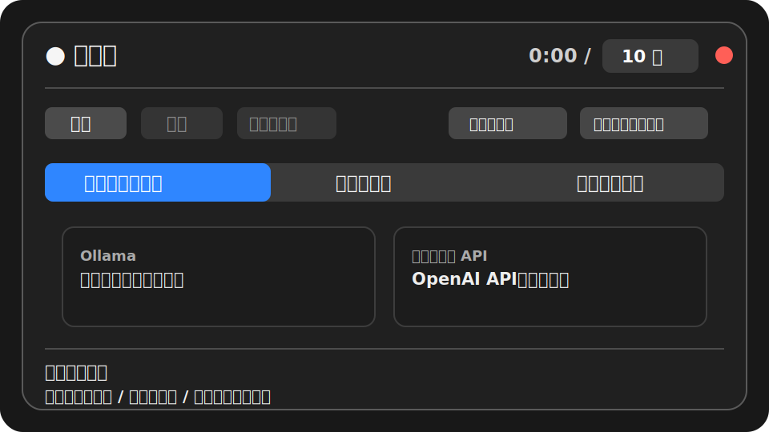
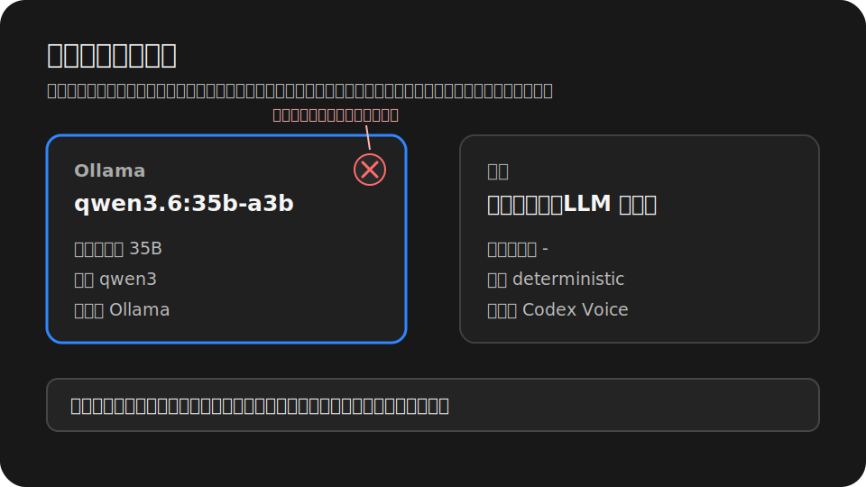
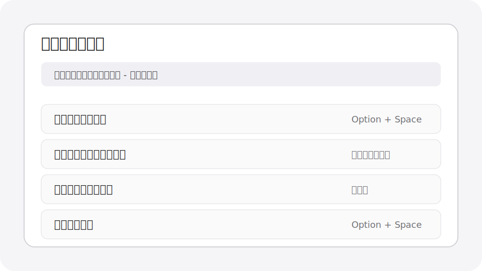
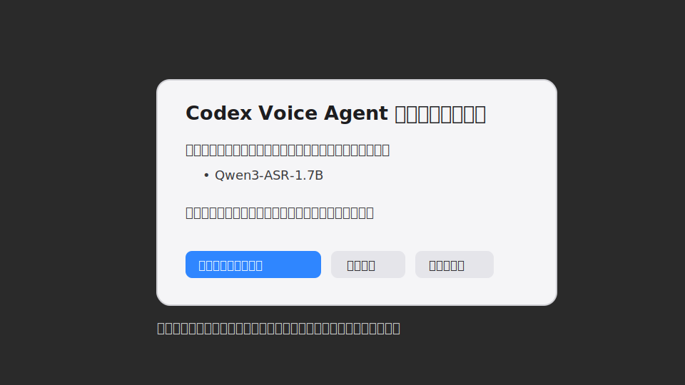

# Codex Voice Input

Codex Voice Input は、ローカル優先の macOS 音声入力ツールです。内蔵グローバルホットキーを 1 回押すと録音開始、もう 1 回押すと送信します。メニューバー設定で選んだ言語に従って、英語、簡体字中国語、繁体字中国語、日本語のいずれかで文字起こし、補正、出力を行います。技術用語、コマンド、パス、変数名、ファイル名は可能な限り標準的な英語またはコード表記のまま保持します。最終テキストはクリップボードへ保存し、現在のフォーカスが入力欄だと確認できた場合だけ自動で貼り付けます。

言語：[English](README.md) | [简体中文](README.zh-CN.md) | [繁體中文](README.zh-TW.md) | 日本語

## 想定ユーザー

- Codex Desktop、Cursor、VS Code、ブラウザ、チャットツールなどで、英語、簡体字中国語、繁体字中国語、日本語に技術用語を混ぜて入力する人。
- 音声認識と用語補正をできるだけローカルで完結させたい人。
- グローバルホットキーを常駐メニューバー Agent が直接処理する軽い操作感を求める人。

## 主な機能

- 内蔵グローバルホットキー：既定は `Option + Space`。メニューバーパネルから録り直せます。
- macOS メニューバーパネル：開始、送信、キャンセル、権限、モデル、入力デバイス、ログをまとめて操作。
- 4 言語ワークフロー：UI 言語設定が Whisper 認識言語、Ollama 補正プロンプト、CLI ユーザー出力、最終出力の文字体系も制御します。
- ローカル文字起こし：Apple Silicon 向けに `mlx-whisper` large-v3-turbo を標準使用し、`faster-whisper` fallback も用意。
- ローカル補正：Ollama の `qwen3.6:35b-a3b` を標準使用し、認識エラー、技術用語、書式を保守的に補正。
- 統一貼り付け方針：最終テキストは必ずクリップボードに保存し、現在のフォーカスが編集可能な場合だけ `Cmd+V` を送信。
- モデル管理：Ollama の自動起動、現在の qwen モデルの自動ロード、`keep_alive`、UI からのモデルアンロードに対応。

## 仕組み

```text
内蔵グローバルホットキー
        |
        v
com.codexvoice.agent LaunchAgent
        |
        +-- 録音、送信、キャンセル、メニューバー UI
        +-- UI/実行時言語の解決
        +-- 解決済み言語での Whisper 文字起こし
        +-- terms.json による決定的な用語置換
        +-- 解決済み言語での Ollama ローカル LLM 補正
        +-- pbcopy でクリップボードへ保存
        +-- 入力欄にフォーカスがある場合だけ Cmd+V
```

## 必要環境

- macOS 13 以降。
- Apple Silicon Mac 推奨。Intel Mac でも動きますが、ローカル文字起こしは遅くなる可能性があります。
- Conda、Miniconda、Miniforge、または Anaconda。
- Homebrew で `ffmpeg` と `portaudio` を入れておくことを推奨。
- Ollama は任意ですが、ローカル LLM 補正には強く推奨します。

## インストール

リポジトリは標準の実行ディレクトリへ置くのがおすすめです。

```bash
git clone https://github.com/dataindustry/codex-voice.git ~/CodexVoice
cd ~/CodexVoice
bash ~/CodexVoice/bin/install.sh
```

別の場所に clone 済みの場合は、標準ディレクトリへ同期してからインストールします。

```bash
mkdir -p ~/CodexVoice
rsync -a --exclude .git /path/to/codex-voice/ ~/CodexVoice/
bash ~/CodexVoice/bin/install.sh
```

インストールスクリプトが行うこと：

- `bin/`、`config/`、`recordings/`、`transcripts/`、`logs/`、`state/` を作成。
- Homebrew、`ffmpeg`、`portaudio`、Ollama を確認。
- Conda 環境 `codex-voice` を作成または更新。
- `pyproject.toml` から Codex Voice を editable package としてインストールし、テスト/静的チェック用ツールも入れます。
- メインプログラムとインストールスクリプトに実行権限を付与。
- `com.codexvoice.agent` LaunchAgent をビルドして起動。
- Swift 製の録音インジケータとメニューバー Agent をビルド。

Python 依存関係を再インストールせず Agent だけ更新する場合：

```bash
bash ~/CodexVoice/bin/install.sh --skip-deps
```

Agent の状態確認：

```bash
launchctl print gui/$(id -u)/com.codexvoice.agent
```

## AI Agent Installation Playbook

同じ Mac 上で AI coding agent に Codex Voice をインストールまたは更新させる場合は、この節を渡してください。

目標：ソースを `~/CodexVoice` にインストールまたは更新し、ユーザー設定をできるだけ保持し、メニューバー Agent をコンパイルし、内蔵ホットキー/Ollama 連携を検証します。

実行ルール：

- ユーザーが明示しない限り、`~/CodexVoice/config/terms.json`、`transcripts/`、録音、ログ、状態ファイル、ユーザー編集済み設定を削除しない。
- `git reset --hard` のような破壊的 git コマンドを実行しない。
- リポジトリが別の場所に clone されている場合は、先にソースを `~/CodexVoice` へ同期してから installer を実行する。
- Ollama が無い場合は報告し、`ollama pull qwen3.6:35b-a3b` を示すだけにする。大きなモデルを無断でダウンロードしない。

推奨コマンド：

```bash
mkdir -p ~/CodexVoice
rsync -a --exclude .git /path/to/codex-voice/ ~/CodexVoice/
bash ~/CodexVoice/bin/install.sh
```

検証コマンド：

```bash
launchctl print gui/$(id -u)/com.codexvoice.agent
codex-voice --status
codex-voice-config --show
codex-voice-config --list-ollama-models
```

インストール後、人間のユーザーは macOS System Settings で Microphone と Accessibility を許可する必要があります。既定の内蔵ホットキーは `Option + Space` です。

## macOS 権限

初回利用時には 2 つの権限が必要です。

マイク権限：

```text
System Settings -> Privacy & Security -> Microphone
```

`Codex Voice Agent.app`、または録音を起動したターミナル/ホストアプリに許可を与えてください。確認ダイアログが出ない場合は、メニューバーパネルの「麦克风授权」を押してから再度録音を開始します。

アクセシビリティ権限：

```text
System Settings -> Privacy & Security -> Accessibility
```

次のアプリを許可します。

```text
~/CodexVoice/Codex Voice Agent.app
```

この権限は、現在のフォーカスが編集可能か確認し、編集可能な場合に `Cmd+V` を送るためだけに使います。入力欄にフォーカスがない場合、Codex Voice は無理に貼り付けず、テキストをクリップボードに残します。

ソースからのインストールでは ad-hoc 署名を使います。Agent を再ビルドまたは再署名した場合、インストールスクリプトは `tccutil` でアクセシビリティ項目をリセットして System Settings を開きますが、macOS ではユーザーが手動で再度許可する必要があります。

## プライバシー既定値

Codex Voice はローカル優先のツールです。既定では録音は一時ファイルとして扱われ、文字起こし後に削除されます。

```json
"save_recordings": false,
"save_transcripts": true
```

文字起こし結果は `~/CodexVoice/transcripts` に保存され、認識品質の確認に使えます。raw text、final text、補正メタデータを保存したくない場合は、`save_transcripts` を `false` にしてください。

## 内蔵ホットキー

メニューバー Agent は起動時にネイティブのグローバルホットキーを登録します。既定は `Option + Space` です。

メニューバーパネルでは次の操作ができます。

- 新しいホットキーを録る；
- 現在のホットキーをクリアする；
- 既定の `Option + Space` に戻す。

ホットキーが押されると、Agent は直接 `codex-voice.py --toggle` を呼びます。古い外部トリガーファイル連携はメインのソースツリーから削除され、ホットキー処理は常駐 Agent に統一されています。

## 言語と出力方針

Codex Voice は話者の言語を自動検出しません。設定オーバーレイで選んだ言語が、処理全体の製品方針になります。

| 設定 | Whisper 言語 | 補正/出力の挙動 |
| --- | --- | --- |
| `システムに従う` | macOS の優先言語から解決します。未対応のシステム言語は英語に fallback します。 | 下の解決済み言語を使います。 |
| `English` | `en` | 英語として補正し、英語で出力します。 |
| `简体中文` | `zh` | 簡体字中国語として補正し、簡体字中国語で出力します。英語の技術用語は英語のまま残します。 |
| `繁體中文` | `zh` | 繁体字中国語として補正し、繁体字中国語で出力します。英語の技術用語は英語のまま残します。 |
| `日本語` | `ja` | 日本語として補正し、日本語で出力します。英語の技術用語は英語のまま残します。 |

メニューバーパネルの設定オーバーレイ、または CLI から変更できます。

```bash
codex-voice-config --set-ui-language system
codex-voice-config --set-ui-language en
codex-voice-config --set-ui-language zh-Hans
codex-voice-config --set-ui-language zh-Hant
codex-voice-config --set-ui-language ja
```

## Ollama 設定

Ollama をインストールしたら、推奨補正モデルを取得します。

```bash
ollama pull qwen3.6:35b-a3b
```

Ollama が標準の `127.0.0.1:11434` 以外で動いている場合は、launchd 環境変数で Agent に知らせます。

```bash
launchctl setenv OLLAMA_HOST 127.0.0.1:11435
bash ~/CodexVoice/bin/install-launch-agents.sh
```

Ollama URL の解決順：

1. `OLLAMA_HOST`
2. `launchctl getenv OLLAMA_HOST`
3. ユーザーが明示した非標準の `ollama_base_url` または `ollama_url`
4. 標準 `http://127.0.0.1:11434`

モデル検出結果を見る：

```bash
conda run -n codex-voice python ~/CodexVoice/bin/codex-voice-config.py --list-ollama-models
```

現在の補正モデルを事前ロード：

```bash
conda run -n codex-voice python ~/CodexVoice/bin/codex-voice-config.py --prepare-current-correction-model
```

主な標準設定：

```json
"ollama_model": "qwen3.6:35b-a3b",
"ollama_num_ctx": 4000,
"ollama_num_predict": 256,
"ollama_keep_alive": -1,
"ollama_timeout_seconds": 7,
"ollama_skip_simple_utterances": true
```

補足：

- `keep_alive: -1` は Ollama リクエストのパラメータで、qwen モデルをできるだけメモリに残す指定です。macOS LaunchAgent の `KeepAlive` とは別物です。
- `num_ctx: 4000` は、通常の 10 分以内の音声から得たテキスト補正を想定しています。非常に長い原稿は分割を推奨します。
- Ollama がインストール済みでサービスだけ停止している場合、Agent は自動起動または起こす処理を試みます。
- 標準 qwen モデルが未インストールの場合、UI は現在の言語で `qwen3.6:35b-a3b` が未インストールであることを表示します。大きなモデルを自動ダウンロードすることはありません。

## モデル選択の目安

音声認識モデル：

| モデル | 推奨度 | 説明 |
| --- | --- | --- |
| `mlx-community/whisper-large-v3-turbo` | 標準推奨 | Apple Silicon で速度と精度のバランスが良い標準ルート。 |
| `faster-whisper large-v3-turbo` | 互換 fallback | MLX が使えない場合の代替。通常は遅めですが互換性があります。 |
| Ollama audio/Whisper 系モデル | 実験的 | Ollama が audio 能力を持つモデル、または ASR/Whisper らしい名前のモデルを検出した場合のみ表示。 |

補正モデル：

| モデル | 推奨度 | 説明 |
| --- | --- | --- |
| `qwen3.6:35b-a3b` | 標準推奨 | 多言語口述補正、IT 用語の保持、保守的な修正に使うローカル標準候補。メモリ消費は大きく、常駐ロード向き。 |
| 中規模 Qwen / coder モデル | 任意 | メモリを抑えたい場合に試せます。応答は速くなりますが、補正品質は標準 35B より落ちやすいです。 |
| `qwen2.5-coder:1.5b` | 速度テスト向け | とても速い一方、自然な口述をコード風や英語風に変えやすいため常用には非推奨。 |
| `ルール補正（LLM なし）` | 高速 fallback | Ollama は不要です。モデル未インストール時や決定的な用語置換だけでよい場合に使います。 |

## UI とスクリーンショット説明

以下の画像は日本語 UI のスクリーンショット説明です。他言語の README はそれぞれの言語別パスを参照するため、あとで言語ごとに同名の実スクリーンショットへ差し替えても README のリンクは変えずに済みます。

### メニューバーメインパネル



メインパネルは Codex Voice を日常的に操作する中心です。

- 上部ステータス行: ドットとラベルで待機中、録音中、文字起こし中、エラーを表示します。タイマーは録音時間を示し、最大録音時間はその場で調整できます。赤いボタンは Agent の終了です。
- 波形エリア: 録音中または入力デバイスのテスト中に、マイク入力が届いているかを確認できます。
- 録音操作: `開始`、`送信`、`キャンセル` は、録音開始、現在の録音の送信、現在の録音の破棄に対応します。
- 権限と設定: 言語選択、マイク権限、アクセシビリティ権限、内蔵ホットキーの録音、クリア、既定値復元、録音インジケータ切り替えをここで管理します。
- タブ: `音声認識モデル`、`補正モデル`、`入力デバイス` が下のカード領域を切り替えます。カード領域の高さは現在の内容に合わせて縮み、別タブの古い高さを残しません。
- 下部サマリー: 現在の状態、音声認識モデル、補正モデル、入力デバイスをまとめて確認できます。

### モデルカード



モデルカードでは、音声認識モデル、補正モデル、入力デバイスを選びます。

- 各カードには、ソース、モデル名、パラメータ規模、アーキテクチャ、提供元が表示されます。情報がない項目は余白で無理に高さを増やしません。
- 同じグループ内のカードは等しい高さになりますが、高さは内容から自動測定されます。長いモデル名は固定幅の中で折り返されます。
- 選択中のカードは強調表示されます。使えないカードには、スキャン中、Ollama 起動中、qwen 未インストール、入力デバイス未検出などの理由が表示されます。
- カード一覧は横方向にドラッグまたはスクロールできます。複数の Ollama モデルや入力デバイスがあってもレイアウトを押しつぶしません。
- ロード済み Ollama モデルの右上には丸い `X` が表示されます。クリックするとメモリからのみアンロードし、ディスク上のモデルファイルは削除しません。
- qwen がインストール済みで未ロードの場合、Codex Voice はカード領域にロード状態を表示し、設定された Ollama `keep_alive` とコンテキスト長でモデルを準備します。

### 内蔵ホットキー



設定オーバーレイで、録音開始と送信に使うネイティブグローバルホットキーを管理します。

- 既定値は `Option + Space` です。
- 通常のキー組み合わせには少なくとも 1 つの修飾キーが必要です。保存前に macOS の公開ホットキー登録 API で利用可否を確認します。
- double Control のような修飾キーのみのダブルタップも録音できます。ただし macOS には、この種類のジェスチャーが他アプリに使われているかを公開 API で確実に調べる方法がないため、「衝突なし確認済み」とは表示しません。
- `クリア` は現在の内蔵ホットキーを無効化し、`既定値` は `Option + Space` に戻します。
- オーバーレイ表示中は下のカード領域をブロックするため、カードの hover、クリック、スクロールは背後に抜けません。

### 終了時のモデルアンロード



終了フローでは、実行中の録音とメモリ上の Ollama モデルを明示的に扱います。

- 録音 worker が動いている場合、Codex Voice は録音をキャンセルして終了するか確認します。
- Ollama にロード済みモデルがある場合、ダイアログにモデル名を表示し、`モデルをアンロードして終了`、`終了のみ`、`キャンセル` を選べます。
- `モデルをアンロードして終了` は Ollama に `keep_alive: 0` を送り、メモリ上のモデルだけを解放します。インストール済みモデルは削除しません。
- アンロード失敗は表示されますが、Agent が終了フローで無限に止まることはありません。

## よく使う操作

```text
内蔵ホットキーを 1 回押す -> 録音開始
同じホットキーをもう 1 回押す -> 録音を送信
```

最大録音時間を設定：

```bash
conda run -n codex-voice python ~/CodexVoice/bin/codex-voice-config.py --set-max-minutes 10
```

設定、用語表、文字起こし履歴、ログを開く：

```bash
open -e ~/CodexVoice/config/config.json
open -e ~/CodexVoice/config/terms.json
open ~/CodexVoice/transcripts
tail -n 120 ~/CodexVoice/logs/codex-voice.log
```

## 設定ファイル

主な設定：

```text
~/CodexVoice/config/config.json
```

重要な言語フィールド：

```json
"ui_language": "system"
```

`ui_language` は `system`、`en`、`zh-Hans`、`zh-Hant`、`ja` のいずれかです。UI テキスト、CLI ユーザー出力、Whisper 認識言語、Ollama 補正プロンプト、最終出力の文字体系を制御します。`output_language` や `force_simplified_chinese` などの旧フィールドは互換性のために読み取られる場合がありますが、新しい設定では `ui_language` を使ってください。

用語と決定的な置換：

```text
~/CodexVoice/config/terms.json
```

補正プロンプト：

```text
~/CodexVoice/config/correction_prompt.txt
```

決定的な置換は Ollama 補正より前に実行されます。`terms.json` には、プロジェクト名、ライブラリ名、コマンド、ファイル名、略語、安定して出る誤認識を入れるのが向いています。

## トラブルシューティング

内蔵ホットキーが使えない：

```bash
tail -n 120 ~/CodexVoice/logs/codex-voice.log
open -e ~/CodexVoice/config/config.json
```

メニューバーパネルを開いてください。ホットキーが利用不可または競合の可能性ありと表示される場合は、別のキー組み合わせを録るか既定値に戻してください。

Agent が動いていない：

```bash
bash ~/CodexVoice/bin/install-launch-agents.sh
launchctl print gui/$(id -u)/com.codexvoice.agent
```

Ollama モデルが表示されない：

```bash
which ollama
ollama list
conda run -n codex-voice python ~/CodexVoice/bin/codex-voice-config.py --list-ollama-models
```

自動貼り付けできない場合は、アクセシビリティ権限と現在のフォーカスが入力欄であることを確認してください。Agent を再ビルドした直後は、インストールスクリプトが項目をリセットして System Settings を開いたあと、手動で再度許可してください。自動貼り付けしない場合でも、最終テキストはクリップボードに残ります。

## 停止または削除

```bash
launchctl bootout gui/$(id -u) ~/Library/LaunchAgents/com.codexvoice.agent.plist
rm -f ~/Library/LaunchAgents/com.codexvoice.agent.plist
rm -rf ~/CodexVoice
```

今回だけ終了したい場合は、メニューバーパネル右上の赤い終了ボタンを押します。macOS LaunchAgent の `KeepAlive` は `false` なので、ユーザーが終了した直後に自動再起動されることはありません。
