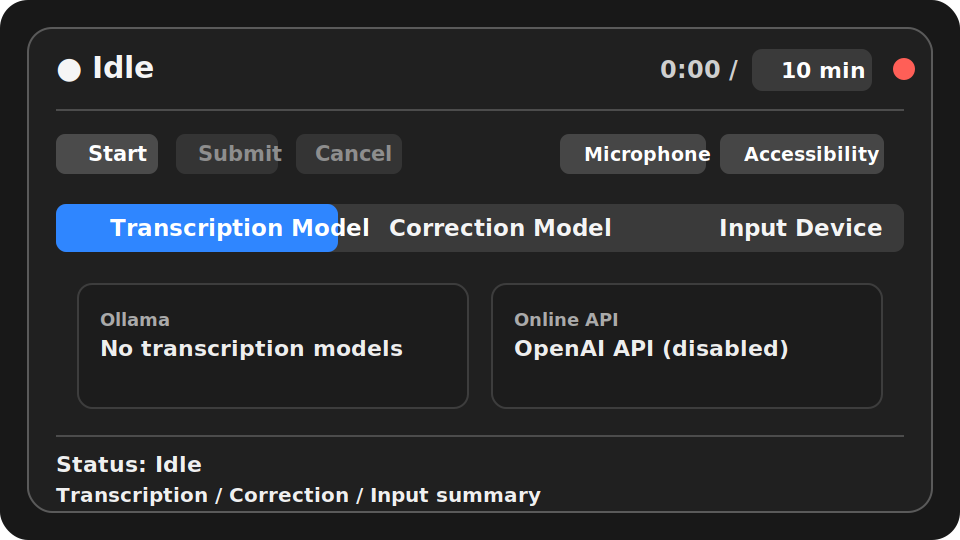
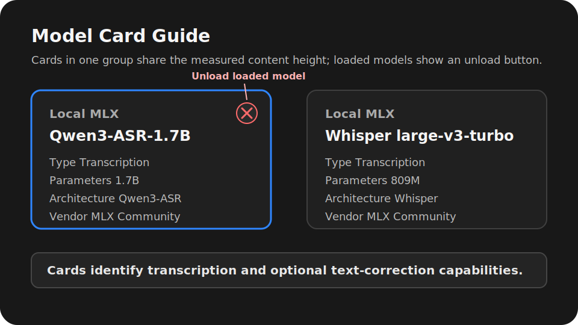
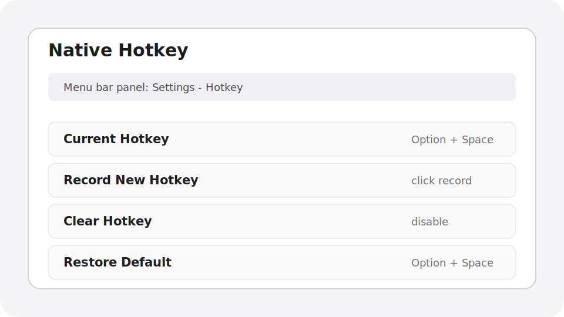
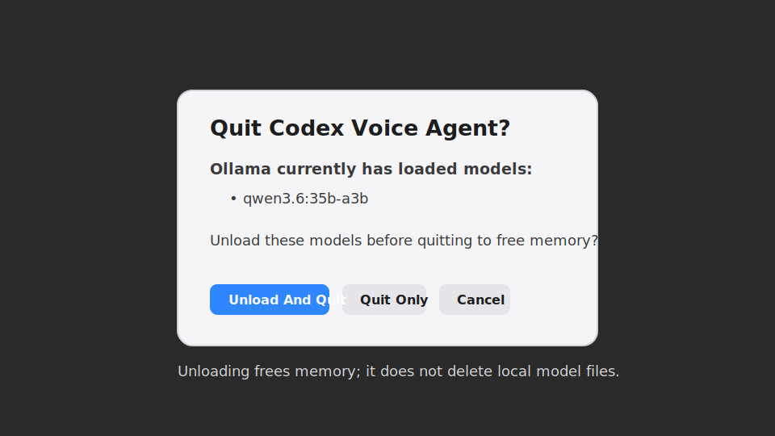

# Codex Voice Input

Codex Voice Input is a local-first macOS voice input tool. Press the built-in global hotkey once to start recording, press it again to submit. Codex Voice transcribes, corrects, and outputs in the language selected in the menu bar settings: English, Simplified Chinese, Traditional Chinese, or Japanese. Technical terms, commands, paths, variables, and file names are preserved where possible. The final text is copied to the clipboard and auto-pasted only when the current focus is confirmed to be an editable text field.

Languages: English | [简体中文](README.zh-CN.md) | [繁體中文](README.zh-TW.md) | [日本語](README.ja.md)

## Who It Is For

- People who often dictate English, Simplified Chinese, Traditional Chinese, or Japanese mixed with technical terms in Codex Desktop, Cursor, VS Code, browsers, chat tools, or any text field.
- People who want transcription and terminology correction to run primarily on the local machine.
- People who want a fast global hotkey handled directly by the resident menu bar Agent.

## Highlights

- Built-in global hotkey: default `Option + Space`; record a different combination from the menu bar panel.
- macOS menu bar panel: recording controls, permissions, models, input devices, logs, and model management in one popover.
- Unified transcription tab: choose Qwen3-ASR or MLX Whisper from the same model picker.
- Optional MLX correction: Qwen3.6 text correction can be enabled after either transcription model, and clicking the selected correction card again disables it.
- Four-language workflow: the UI language setting controls ASR language, correction prompts, CLI user output, and final output script.
- Persistent local MLX service: models stay loaded when the menu bar Agent exits and can be unloaded explicitly from the UI.
- Unified paste behavior: always writes final text to the clipboard first; sends `Cmd+V` only when the focused element is editable.
- Model management: download from ModelScope, load models into MLX memory, inspect residency, and unload models from the UI.

## How It Works

```text
Built-in global hotkey
        |
        v
com.codexvoice.agent LaunchAgent
        |
        +-- recording, submit, cancel, menu bar UI
        +-- UI/runtime language resolution
        +-- transcription: Qwen3-ASR or MLX Whisper
        +-- deterministic terms/rules
        +-- optional Qwen3.6 text correction
        +-- persistent MLX model service shared by all local models
        +-- pbcopy to clipboard
        +-- Cmd+V only when the current focus is editable
```

## Requirements

- macOS 13 or newer.
- Apple Silicon Mac. The local MLX runtime is designed for Apple Silicon.
- Conda, Miniconda, Miniforge, or Anaconda.
- Homebrew with `ffmpeg` and `portaudio` recommended.

## Installation

The recommended setup is to place the repository at the default runtime path:

```bash
git clone https://github.com/dataindustry/codex-voice.git ~/CodexVoice
cd ~/CodexVoice
bash ~/CodexVoice/bin/install.sh
```

If you already cloned it elsewhere, sync it to the default runtime path first:

```bash
mkdir -p ~/CodexVoice
rsync -a --exclude .git /path/to/codex-voice/ ~/CodexVoice/
bash ~/CodexVoice/bin/install.sh
```

The installer will:

- Create `bin/`, `config/`, `models/`, `recordings/`, `transcripts/`, `logs/`, and `state/`.
- Check Homebrew, `ffmpeg`, and `portaudio`.
- Create or update the `codex-voice` Conda environment.
- Install Codex Voice as an editable Python package from `pyproject.toml`, including test and lint tools.
- Mark the main program and install scripts executable.
- Compile and start the `com.codexvoice.agent` and `com.codexvoice.model-service` LaunchAgents.
- Compile the native Swift recording indicator and menu bar Agent.

To rebuild the Agent without reinstalling Python dependencies:

```bash
bash ~/CodexVoice/bin/install.sh --skip-deps
```

Check whether the Agent is running:

```bash
launchctl print gui/$(id -u)/com.codexvoice.agent
```

## AI Agent Installation Playbook

Use this section when asking an AI coding agent to install Codex Voice on the same Mac.

Goal: install or update Codex Voice under `~/CodexVoice`, keep user configuration intact, compile the menu bar Agent, and verify the native hotkey and persistent MLX model service.

Rules for the agent:

- Do not delete `~/CodexVoice/config/terms.json`, `transcripts/`, recordings, logs, state, or user-edited config unless explicitly asked.
- Do not run destructive git commands such as `git reset --hard`.
- If the repo is cloned elsewhere, sync source files to `~/CodexVoice` before running the installer.
- Do not download the default model set unless the user approves roughly 25 GB of downloads.

Recommended commands:

```bash
mkdir -p ~/CodexVoice
rsync -a --exclude .git /path/to/codex-voice/ ~/CodexVoice/
bash ~/CodexVoice/bin/install.sh
```

Verification commands:

```bash
launchctl print gui/$(id -u)/com.codexvoice.agent
codex-voice --status
codex-voice-config --show
codex-voice-config --list-models
launchctl print gui/$(id -u)/com.codexvoice.model-service
```

After installation, the human user must grant Microphone and Accessibility permissions in macOS System Settings. The default built-in hotkey is `Option + Space`.

## macOS Permissions

Two permissions are needed on first use.

Microphone:

```text
System Settings -> Privacy & Security -> Microphone
```

Grant access to `Codex Voice Agent.app` or the terminal/host that starts recording. If macOS does not show a prompt, click the microphone authorization button in the menu bar panel, then start recording again.

Accessibility:

```text
System Settings -> Privacy & Security -> Accessibility
```

Grant access to:

```text
~/CodexVoice/Codex Voice Agent.app
```

Accessibility is used only to check whether the focused element is editable and, when it is, to send `Cmd+V`. If the focus is not in a text field, Codex Voice will not force a paste; it leaves the final text in the clipboard.

Source installs use ad-hoc signing. When the Agent is rebuilt or re-signed, the install script resets the Accessibility entry with `tccutil` and opens System Settings; macOS still requires the user to re-enable the permission manually.

## Privacy Defaults

Codex Voice is local-first. By default, audio recordings are temporary and deleted after transcription:

```json
"save_recordings": false,
"save_transcripts": true
```

Transcripts are saved under `~/CodexVoice/transcripts` to help review recognition quality. Set `save_transcripts` to `false` if you do not want final text, raw text, and correction metadata stored on disk.

## Native Hotkey

The menu bar Agent registers a native global hotkey at startup. The default is `Option + Space`.

Use the menu bar panel to:

- record a new hotkey;
- clear the current hotkey;
- restore the default `Option + Space`.

When the hotkey is pressed, the Agent directly calls `codex-voice.py --toggle`. Legacy external trigger-file integration has been removed from the main source tree; the resident Agent owns hotkey handling.

## Language And Output Policy

Codex Voice does not auto-detect the speaker language. The language selected in the settings overlay is the product policy for the whole pipeline:

| Setting | ASR language | Correction/output behavior |
| --- | --- | --- |
| `Follow System` | Resolved from macOS preferred languages; unsupported system languages fall back to English. | Uses the resolved language below. |
| `English` | `en` | Corrects and outputs English. |
| `简体中文` | `zh` | Corrects and outputs Simplified Chinese; English technical terms stay in English. |
| `繁體中文` | `zh` | Corrects and outputs Traditional Chinese; English technical terms stay in English. |
| `日本語` | `ja` | Corrects and outputs Japanese; English technical terms stay in English. |

You can change this from the menu bar panel settings overlay, or from the CLI:

```bash
codex-voice-config --set-ui-language system
codex-voice-config --set-ui-language en
codex-voice-config --set-ui-language zh-Hans
codex-voice-config --set-ui-language zh-Hant
codex-voice-config --set-ui-language ja
```

## Transcription And Local Models

All selectable speech and correction models are internal MLX models. OpenAI-compatible, Ollama-hosted, and non-MLX Whisper choices are not shown in the model picker.

The first model tab is always `Transcription Model`:

- `Qwen3-ASR-1.7B`: direct end-to-end ASR, selected by default for new installs.
- `Whisper large-v3-turbo`: MLX Whisper transcription, useful as a mature fallback for accents, microphones, or vocabulary where Qwen3-ASR is weaker.

The correction tab is optional. Select `Qwen3.6-35B-A3B-4bit` to run text correction after the selected transcription model. Click the selected correction card again to turn correction off and keep only deterministic `terms.json` rules.

For compatibility, the config still stores `processing_route`: choosing Qwen3-ASR sets it to `direct_asr`; choosing Whisper sets it to `two_stage`. Users normally change this from the transcription cards rather than editing the field directly.

All model snapshots are downloaded from ModelScope into `~/CodexVoice/models`. The installer asks before downloading the complete default set:

```bash
bash ~/CodexVoice/bin/install.sh --download-models
codex-voice-config --list-models
```

You can download one model or warm the currently selected transcription/correction set separately:

```bash
codex-voice-config --download-model qwen3-asr-1.7b-8bit
codex-voice-config --download-model whisper-large-v3-turbo
codex-voice-config --download-model qwen3.6-35b-a3b-4bit
codex-voice-config --prepare-current-route-models
```

Clicking a not-yet-installed model card starts the download immediately and shows a system progress bar labeled `Downloading model`. Clicking an installed but unloaded model loads it into memory and shows a system progress bar labeled `Loading model`.

The `com.codexvoice.model-service` process owns loaded MLX models. Closing the menu bar Agent leaves the service and its models resident. The card `X` unloads one model; `Unload And Quit` stops the service and releases all loaded models.

## Model Recommendations

Transcription models:

| Model | Recommendation | Notes |
| --- | --- | --- |
| `mlx-community/Qwen3-ASR-1.7B-8bit` | Default transcription choice | End-to-end ASR with low latency and modest memory use. Best first choice for ordinary dictation. |
| `mlx-community/whisper-large-v3-turbo` | Alternative transcription choice | Mature multilingual ASR. Use it when Qwen3-ASR quality is weaker for a particular microphone, accent, or vocabulary. |

Correction models:

| Model | Recommendation | Notes |
| --- | --- | --- |
| `mlx-community/Qwen3.6-35B-A3B-4bit` | Optional enhanced correction | High-quality multilingual correction and technical-term preservation. It uses much more memory than transcription-only mode. |
| `Rule correction (no LLM)` | Deterministic option | Skips the large correction model while retaining `terms.json` replacements. |

Guidance:

- Start with Qwen3-ASR for lower latency and memory.
- Compare the same recordings with MLX Whisper when recognition quality needs another ASR baseline.
- Enable Qwen3.6 correction only when terminology or sentence cleanup needs more help.
- Model selection never silently falls back to another model. Missing models are shown as not installed and can be downloaded from the card.

## UI And Screenshot Guide

The images below are English screenshot guides. The other READMEs point to their own localized screenshot paths, so real screenshots can be replaced per language without changing the document links.

### Menu Bar Main Panel



Use the main panel as the daily control surface:

- Status row: the dot and label show idle, recording, transcribing, or error state; the timer shows elapsed time and the selected recording limit; the red button quits the Agent.
- Waveform area: gives a quick visual signal while recording or testing the input device.
- Recording actions: `Start`, `Submit`, and `Cancel` match the first hotkey press, second hotkey press, and abort workflow.
- Permissions and settings: language selection, microphone permission, Accessibility permission, native hotkey recording, reset/default controls, and the floating recording indicator are managed from this area.
- Tabs: `Transcription Model`, `Correction Model`, and `Input Device`.
- Transcription tab: contains both Qwen3-ASR and MLX Whisper choices.
- Bottom summary: shows state, selected transcription model, optional correction state, and input device.

### Model Cards



Model cards are intentionally compact and equal-height within the current tab:

- Each model card shows its role: transcription or text correction, plus size, architecture, and vendor.
- The selected card is highlighted; clicking the selected correction model again disables correction.
- A missing snapshot is shown as not installed. Clicking it downloads the model and shows the system progress bar.
- An installed but unloaded model loads into memory with the system progress bar before use.
- Long model names wrap inside the fixed card width. The horizontal card list can still be dragged or scrolled.
- Loaded MLX models show a circular `X` in the top-right corner. Clicking it unloads that model from memory without deleting its snapshot.

### Native Hotkey



The settings overlay records the global hotkey used to start and submit dictation:

- The default is `Option + Space`.
- Ordinary key combinations must include at least one modifier. Codex Voice checks them with macOS public hotkey registration APIs before saving.
- Modifier-only double-tap gestures, such as double Control, can be recorded, but macOS does not provide a public API for reliable conflict detection for that gesture type.
- `Clear` disables the native hotkey; `Default` restores `Option + Space`.
- The overlay blocks the panel underneath while open, so card hover and click behavior do not leak through it.

### Quit And Unload Models



The quit flow is explicit about work that may continue outside the Agent:

- If a recording worker is active, Codex Voice prompts before cancelling it and quitting.
- If the model service has loaded models, the dialog lists their names and offers `Unload And Quit`, `Quit Only`, or `Cancel`.
- `Quit Only` leaves the independent model service resident. `Unload And Quit` stops it and releases all model memory without deleting model files.
- Unload failures are reported but do not leave the Agent stuck forever; the quit path has a bounded timeout.

## Common Operations

```text
Press the native hotkey once -> start recording
Press the same hotkey again -> submit recording
```

Set maximum recording duration:

```bash
conda run -n codex-voice python ~/CodexVoice/bin/codex-voice-config.py --set-max-minutes 10
```

Open config, terms, transcripts, and logs:

```bash
open -e ~/CodexVoice/config/config.json
open -e ~/CodexVoice/config/terms.json
open ~/CodexVoice/transcripts
tail -n 120 ~/CodexVoice/logs/codex-voice.log
```

## Configuration Files

Main config:

```text
~/CodexVoice/config/config.json
```

Important language fields:

```json
"ui_language": "system",
"processing_route": "direct_asr"
```

`processing_route` is `direct_asr` or `two_stage` and is maintained by the selected transcription model. `ui_language` drives UI text, CLI output, ASR language, optional Qwen3.6 correction prompts, and final output script.

Terms and deterministic replacements:

```text
~/CodexVoice/config/terms.json
```

Correction prompt:

```text
~/CodexVoice/config/correction_prompt.txt
```

Deterministic replacements run after ASR and before optional Qwen3.6 correction.

## Troubleshooting

Native hotkey does not work:

```bash
tail -n 120 ~/CodexVoice/logs/codex-voice.log
open -e ~/CodexVoice/config/config.json
```

Open the menu bar panel. If it says the hotkey is unavailable or may conflict, record a different key combination or restore the default.

Agent is not running:

```bash
bash ~/CodexVoice/bin/install-launch-agents.sh
launchctl print gui/$(id -u)/com.codexvoice.agent
```

Local models do not show or load:

```bash
codex-voice-config --list-models
launchctl print gui/$(id -u)/com.codexvoice.model-service
tail -n 120 ~/CodexVoice/logs/com.codexvoice.model-service.err.log
```

Auto-paste does not happen:

- Grant Accessibility permission to `~/CodexVoice/Codex Voice Agent.app`.
- If you just rebuilt the Agent, re-enable its Accessibility permission after the install script resets the entry and opens System Settings.
- Make sure the current focus is a text field or text area.
- Even when auto-paste is skipped, the final text is already in the clipboard and can be pasted manually with `Cmd+V`.

No microphone input:

- Check microphone permission.
- Select the correct device from the Input Device tab in the menu bar panel.
- Click the input test button and check whether RMS and Peak change.

## Stop Or Uninstall

Stop the Agent and persistent model service:

```bash
launchctl bootout gui/$(id -u) ~/Library/LaunchAgents/com.codexvoice.agent.plist
launchctl bootout gui/$(id -u) ~/Library/LaunchAgents/com.codexvoice.model-service.plist
```

Remove both LaunchAgents:

```bash
rm -f ~/Library/LaunchAgents/com.codexvoice.agent.plist
rm -f ~/Library/LaunchAgents/com.codexvoice.model-service.plist
```

Remove the runtime directory:

```bash
rm -rf ~/CodexVoice
```

To quit only the current run, click the red quit button in the menu bar panel. The macOS LaunchAgent `KeepAlive` value is `false`, so the system will not immediately relaunch the Agent after a user-initiated quit.
