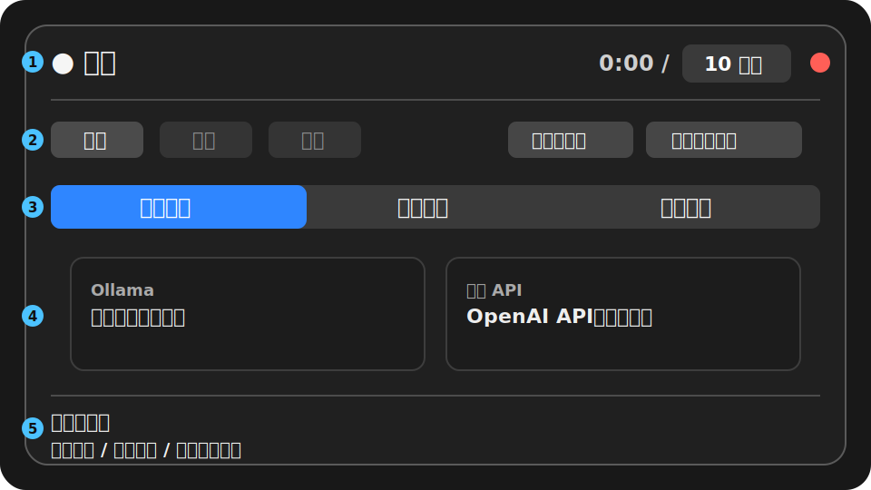
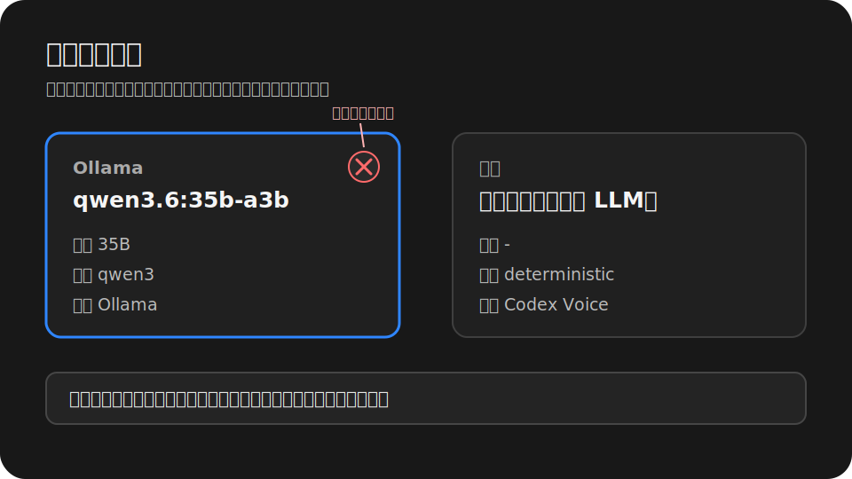
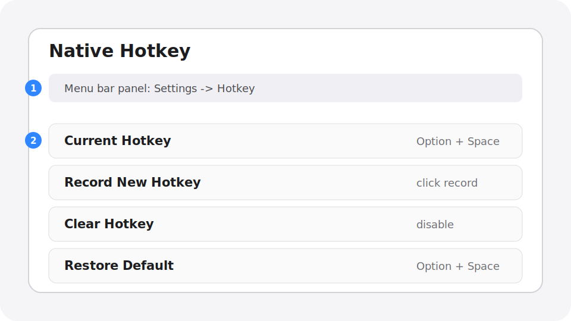
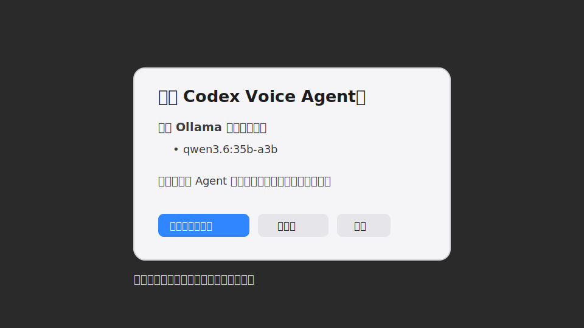

# Codex Voice Input

Codex Voice Input is a local-first macOS voice input tool. Press the built-in global hotkey once to start recording, press it again to submit. Codex Voice transcribes Chinese speech mixed with English IT terminology, applies local term rules and Ollama correction, copies the result to the clipboard, and auto-pastes only when the current focus is confirmed to be an editable text field.

Languages: English | [简体中文](README.zh-CN.md) | [繁體中文](README.zh-TW.md) | [日本語](README.ja.md)

## Who It Is For

- People who often dictate Chinese text mixed with English technical terms in Codex Desktop, Cursor, VS Code, browsers, chat tools, or any text field.
- People who want transcription and terminology correction to run primarily on the local machine.
- People who want a fast global hotkey handled directly by the resident menu bar Agent.

## Highlights

- Built-in global hotkey: default `Option + Space`; record a different combination from the menu bar panel.
- macOS menu bar panel: recording controls, permissions, models, input devices, logs, and model management in one popover.
- Local transcription: defaults to Apple Silicon-friendly `mlx-whisper` large-v3-turbo with a `faster-whisper` fallback.
- Local correction: defaults to Ollama `qwen3.6:35b-a3b` for conservative correction of Chinese recognition errors, technical terms, and formatting.
- Unified paste behavior: always writes final text to the clipboard first; sends `Cmd+V` only when the focused element is editable.
- Model management: can start Ollama, load the configured qwen model, keep it alive, and unload loaded models from the UI.

## How It Works

```text
Built-in global hotkey
        |
        v
com.codexvoice.agent LaunchAgent
        |
        +-- recording, submit, cancel, menu bar UI
        +-- Whisper transcription
        +-- deterministic term replacement from terms.json
        +-- Ollama local LLM correction
        +-- pbcopy to clipboard
        +-- Cmd+V only when the current focus is editable
```

## Requirements

- macOS 13 or newer.
- Apple Silicon Mac recommended. Intel Macs can work, but local transcription may be much slower.
- Conda, Miniconda, Miniforge, or Anaconda.
- Homebrew with `ffmpeg` and `portaudio` recommended.
- Ollama is optional but strongly recommended for local LLM correction.

## Installation

The recommended setup is to place the repository at the default runtime path:

```bash
git clone https://github.com/dataindustry/codex-voice.git ~/CodexVoice
cd ~/CodexVoice
bash ~/CodexVoice/bin/install.sh
```

If you already cloned it elsewhere, sync it to the default runtime path first:

```bash
mkdir -p ~/CodexVoice
rsync -a --exclude .git /path/to/codex-voice/ ~/CodexVoice/
bash ~/CodexVoice/bin/install.sh
```

The installer will:

- Create `bin/`, `config/`, `recordings/`, `transcripts/`, `logs/`, and `state/`.
- Check Homebrew, `ffmpeg`, `portaudio`, and Ollama.
- Create or update the `codex-voice` Conda environment.
- Install Codex Voice as an editable Python package from `pyproject.toml`, including test and lint tools.
- Mark the main program and install scripts executable.
- Compile and start the `com.codexvoice.agent` LaunchAgent.
- Compile the native Swift recording indicator and menu bar Agent.

To rebuild the Agent without reinstalling Python dependencies:

```bash
bash ~/CodexVoice/bin/install.sh --skip-deps
```

Check whether the Agent is running:

```bash
launchctl print gui/$(id -u)/com.codexvoice.agent
```

## AI Agent Installation Playbook

Use this section when asking an AI coding agent to install Codex Voice on the same Mac.

Goal: install or update Codex Voice under `~/CodexVoice`, keep user configuration intact where possible, compile the menu bar Agent, and verify native hotkey/Ollama integration.

Rules for the agent:

- Do not delete `~/CodexVoice/config/terms.json`, `transcripts/`, recordings, logs, state, or user-edited config unless explicitly asked.
- Do not run destructive git commands such as `git reset --hard`.
- If the repo is cloned elsewhere, sync source files to `~/CodexVoice` before running the installer.
- If Ollama is missing, report it and show the `ollama pull qwen3.6:35b-a3b` command; do not download large models without permission.

Recommended commands:

```bash
mkdir -p ~/CodexVoice
rsync -a --exclude .git /path/to/codex-voice/ ~/CodexVoice/
bash ~/CodexVoice/bin/install.sh
```

Verification commands:

```bash
launchctl print gui/$(id -u)/com.codexvoice.agent
codex-voice --status
codex-voice-config --show
codex-voice-config --list-ollama-models
```

After installation, the human user must grant Microphone and Accessibility permissions in macOS System Settings. The default built-in hotkey is `Option + Space`.

## macOS Permissions

Two permissions are needed on first use.

Microphone:

```text
System Settings -> Privacy & Security -> Microphone
```

Grant access to `Codex Voice Agent.app` or the terminal/host that starts recording. If macOS does not show a prompt, click the microphone authorization button in the menu bar panel, then start recording again.

Accessibility:

```text
System Settings -> Privacy & Security -> Accessibility
```

Grant access to:

```text
~/CodexVoice/Codex Voice Agent.app
```

Accessibility is used only to check whether the focused element is editable and, when it is, to send `Cmd+V`. If the focus is not in a text field, Codex Voice will not force a paste; it leaves the final text in the clipboard.

Source installs use ad-hoc signing. When the Agent is rebuilt or re-signed, the install script resets the Accessibility entry with `tccutil` and opens System Settings; macOS still requires the user to re-enable the permission manually.

## Privacy Defaults

Codex Voice is local-first. By default, audio recordings are temporary and deleted after transcription:

```json
"save_recordings": false,
"save_transcripts": true
```

Transcripts are saved under `~/CodexVoice/transcripts` to help review recognition quality. Set `save_transcripts` to `false` if you do not want final text, raw text, and correction metadata stored on disk.

## Native Hotkey

The menu bar Agent registers a native global hotkey at startup. The default is `Option + Space`.

Use the menu bar panel to:

- record a new hotkey;
- clear the current hotkey;
- restore the default `Option + Space`.

When the hotkey is pressed, the Agent directly calls `codex-voice.py --toggle`. Legacy external trigger-file integration has been removed from the main source tree; the resident Agent owns hotkey handling.

## Ollama Setup

After installing Ollama, pull the recommended correction model:

```bash
ollama pull qwen3.6:35b-a3b
```

If Ollama is not running on the default `127.0.0.1:11434`, set a launchd environment variable and restart the Agent:

```bash
launchctl setenv OLLAMA_HOST 127.0.0.1:11435
bash ~/CodexVoice/bin/install-launch-agents.sh
```

Codex Voice resolves the Ollama base URL in this order:

1. `OLLAMA_HOST`
2. `launchctl getenv OLLAMA_HOST`
3. Explicit non-default `ollama_base_url` or `ollama_url` in config
4. Default `http://127.0.0.1:11434`

Inspect detected models:

```bash
conda run -n codex-voice python ~/CodexVoice/bin/codex-voice-config.py --list-ollama-models
```

Warm the current correction model:

```bash
conda run -n codex-voice python ~/CodexVoice/bin/codex-voice-config.py --prepare-current-correction-model
```

Key default correction settings:

```json
"ollama_model": "qwen3.6:35b-a3b",
"ollama_num_ctx": 4000,
"ollama_num_predict": 256,
"ollama_keep_alive": -1,
"ollama_timeout_seconds": 7,
"ollama_skip_simple_utterances": true
```

Notes:

- `keep_alive: -1` is an Ollama request parameter. It asks Ollama to keep the qwen model in memory. It is unrelated to macOS LaunchAgent `KeepAlive`.
- `num_ctx: 4000` targets ordinary correction of transcripts from voice recordings up to about ten minutes. Very long transcripts should still be split.
- If Ollama is installed but the service is not running, the Agent will try to start or wake it.
- If the default qwen model is not installed, the UI shows `未安装 qwen3.6:35b-a3b`. Codex Voice does not automatically download large models.

## Model Recommendations

Transcription models:

| Model | Recommendation | Notes |
| --- | --- | --- |
| `mlx-community/whisper-large-v3-turbo` | Default recommendation | Best default balance of speed and accuracy on Apple Silicon. |
| `faster-whisper large-v3-turbo` | Compatibility fallback | Used when MLX is unavailable. Usually slower, but broader compatibility. |
| Ollama audio/Whisper-like models | Experimental | Shown only when local Ollama reports audio capability or model names that look like ASR/Whisper. |

Correction models:

| Model | Recommendation | Notes |
| --- | --- | --- |
| `qwen3.6:35b-a3b` | Default recommendation | Most stable for Chinese dictation correction, IT term preservation, and conservative edits. Requires more memory and works best kept loaded. |
| Mid-size Qwen / coder models | Optional | Useful when memory is tight. Faster, but usually less stable for Chinese dictation than the default 35B. |
| `qwen2.5-coder:1.5b` | Speed testing only | Very fast, but may over-transform natural dictation into code-like or English output. Not recommended as the default. |
| `规则纠错（不使用 LLM）` | Fast fallback | No Ollama dependency. Use it when Ollama is unavailable or deterministic term replacement is enough. |

Guidance:

- Quality first: keep the default `mlx-whisper large-v3-turbo` + `qwen3.6:35b-a3b`.
- Lower latency: keep qwen loaded and let short utterances bypass Ollama.
- Lower memory: switch to rule-only correction or choose a smaller Ollama text model.

## UI And Screenshot Guide

The images below are stable screenshot guides. They explain the current menu bar UI and can be replaced by same-name real screenshots later without changing the README links.

### Menu Bar Main Panel



Use the main panel as the daily control surface:

- Status row: the dot and label show idle, recording, transcribing, or error state; the timer shows elapsed time and the selected recording limit; the red button quits the Agent.
- Waveform area: gives a quick visual signal while recording or testing the input device.
- Recording actions: `Start`, `Submit`, and `Cancel` match the first hotkey press, second hotkey press, and abort workflow.
- Permissions and settings: microphone permission, Accessibility permission, native hotkey recording, reset/default controls, and the floating recording indicator are managed from this area.
- Tabs: `Transcription Model`, `Correction Model`, and `Input Device` switch the compact card area without keeping stale height from another tab.
- Bottom summary: shows the final active choices for state, transcription model, correction model, and input device.

### Model Cards



Model cards are intentionally compact and equal-height within the current tab:

- Each card shows the source, model name, parameter size, architecture, and vendor when those fields are available.
- The selected card is highlighted; unavailable or placeholder cards explain whether the system is scanning, starting Ollama, missing qwen, or missing an input device.
- Long model names wrap inside the fixed card width. The horizontal card list can still be dragged or scrolled.
- Loaded Ollama models show a circular `X` in the top-right corner. Clicking it unloads that model from memory only; it does not delete model files from disk.
- When the configured qwen model is installed but not loaded, Codex Voice may show the model card while it prepares the model with Ollama `keep_alive` and the configured context size.

### Native Hotkey



The settings overlay records the global hotkey used to start and submit dictation:

- The default is `Option + Space`.
- Ordinary key combinations must include at least one modifier. Codex Voice checks them with macOS public hotkey registration APIs before saving.
- Modifier-only double-tap gestures, such as double Control, can be recorded, but macOS does not provide a public API for reliable conflict detection for that gesture type.
- `Clear` disables the native hotkey; `Default` restores `Option + Space`.
- The overlay blocks the panel underneath while open, so card hover and click behavior do not leak through it.

### Quit And Unload Models



The quit flow is explicit about work that may continue outside the Agent:

- If a recording worker is active, Codex Voice prompts before cancelling it and quitting.
- If Ollama still has loaded models, the dialog lists their names and offers `Unload And Quit`, `Quit Only`, or `Cancel`.
- `Unload And Quit` sends Ollama `keep_alive: 0` for the loaded models, then exits. It only unloads memory; it never deletes installed models.
- Unload failures are reported but do not leave the Agent stuck forever; the quit path has a bounded timeout.

## Common Operations

```text
Press the native hotkey once -> start recording
Press the same hotkey again -> submit recording
```

Set maximum recording duration:

```bash
conda run -n codex-voice python ~/CodexVoice/bin/codex-voice-config.py --set-max-minutes 10
```

Open config, terms, transcripts, and logs:

```bash
open -e ~/CodexVoice/config/config.json
open -e ~/CodexVoice/config/terms.json
open ~/CodexVoice/transcripts
tail -n 120 ~/CodexVoice/logs/codex-voice.log
```

## Configuration Files

Main config:

```text
~/CodexVoice/config/config.json
```

Terms and deterministic replacements:

```text
~/CodexVoice/config/terms.json
```

Correction prompt:

```text
~/CodexVoice/config/correction_prompt.txt
```

Deterministic replacements run before Ollama correction. Good candidates for `terms.json` include project names, library names, commands, file names, acronyms, and stable misrecognitions.

## Troubleshooting

Native hotkey does not work:

```bash
tail -n 120 ~/CodexVoice/logs/codex-voice.log
open -e ~/CodexVoice/config/config.json
```

Open the menu bar panel. If it says the hotkey is unavailable or may conflict, record a different key combination or restore the default.

Agent is not running:

```bash
bash ~/CodexVoice/bin/install-launch-agents.sh
launchctl print gui/$(id -u)/com.codexvoice.agent
```

Ollama models do not show:

```bash
which ollama
ollama list
conda run -n codex-voice python ~/CodexVoice/bin/codex-voice-config.py --list-ollama-models
```

If you use a non-default port, set `OLLAMA_HOST` and restart the Agent.

Auto-paste does not happen:

- Grant Accessibility permission to `~/CodexVoice/Codex Voice Agent.app`.
- If you just rebuilt the Agent, re-enable its Accessibility permission after the install script resets the entry and opens System Settings.
- Make sure the current focus is a text field or text area.
- Even when auto-paste is skipped, the final text is already in the clipboard and can be pasted manually with `Cmd+V`.

No microphone input:

- Check microphone permission.
- Select the correct device from the Input Device tab in the menu bar panel.
- Click the input test button and check whether RMS and Peak change.

## Stop Or Uninstall

Stop the Agent:

```bash
launchctl bootout gui/$(id -u) ~/Library/LaunchAgents/com.codexvoice.agent.plist
```

Remove the LaunchAgent:

```bash
rm -f ~/Library/LaunchAgents/com.codexvoice.agent.plist
```

Remove the runtime directory:

```bash
rm -rf ~/CodexVoice
```

To quit only the current run, click the red quit button in the menu bar panel. The macOS LaunchAgent `KeepAlive` value is `false`, so the system will not immediately relaunch the Agent after a user-initiated quit.
