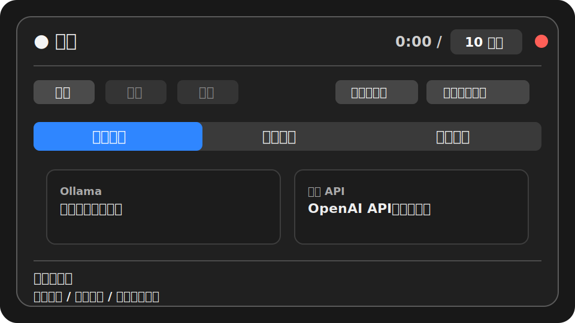
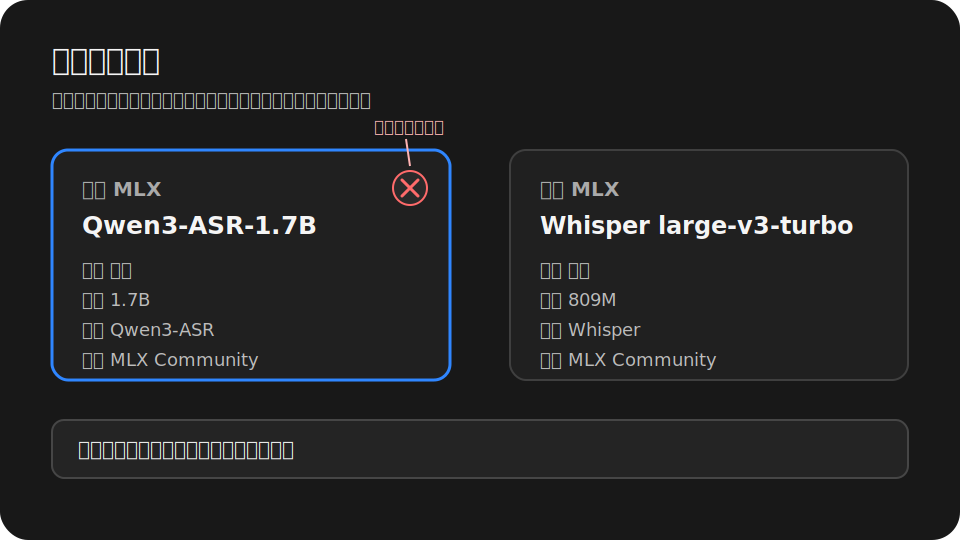
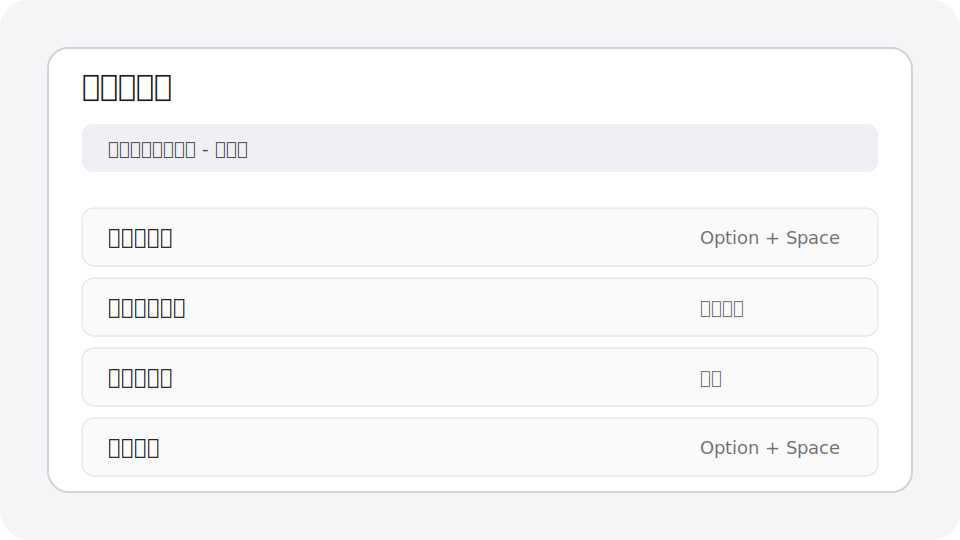
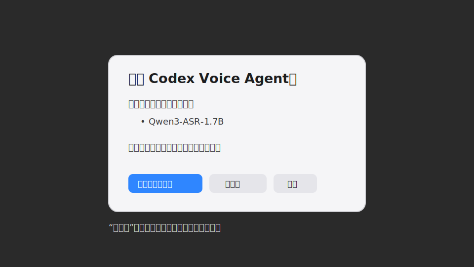

# Codex Voice Input

本地优先的 macOS 语音输入工具。按一次内置全局快捷键开始录音，再按一次提交；Codex Voice 会按照状态栏设置里选择的语言进行转录、纠错和输出：英文、简体中文、繁体中文或日文。技术词、命令、路径、变量名和文件名会尽量保持标准英文或代码写法。最终文本会写入剪贴板，并且只有当前焦点确认是输入框时才自动粘贴。

语言版本：[English](README.md) | 简体中文 | [繁體中文](README.zh-TW.md) | [日本語](README.ja.md)

## 适合谁

- 经常在 Codex Desktop、Cursor、VS Code、浏览器、聊天工具或任意文本框里用英文、简体中文、繁体中文或日文夹杂技术词输入。
- 希望转录和术语纠错主要在本机完成，不把音频默认发到外部服务。
- 希望全局快捷键由常驻状态栏 Agent 直接处理，响应足够轻。

## 核心能力

- 内置全局快捷键：默认 `Option + Space`，也可以在状态栏面板中重新录制。
- macOS 状态栏面板：开始、提交、取消、权限、模型、输入设备和日志入口集中在一个弹窗里。
- 统一转录模型页签：Qwen3-ASR 和 MLX Whisper 都在同一个模型选择区里选择。
- 可选 MLX 纠错：Qwen3.6 文本纠错可以接在任意转录模型之后；再次点击已选中的纠错卡片即可关闭纠错。
- 四语全流程：界面语言设置同时控制 ASR 语言、纠错提示词、CLI 用户输出和最终文本字形。
- 持久本地 MLX 服务：退出菜单栏 Agent 不会卸载模型，用户可以在界面中主动卸载。
- 统一粘贴策略：始终先写入剪贴板；只有当前焦点确认可编辑时才自动模拟 `Cmd+V`。
- 模型管理：从 ModelScope 下载、载入到 MLX 内存、查看驻留状态，并从 UI 卸载模型。

## 工作方式

```text
内置全局快捷键
        |
        v
com.codexvoice.agent LaunchAgent
        |
        +-- 录音、提交、取消、状态栏 UI
        +-- 解析界面/运行时语言
        +-- 转录模型：Qwen3-ASR 或 MLX Whisper
        +-- terms.json/确定性规则
        +-- 可选 Qwen3.6 文本纠错
        +-- 全部本地模型共用独立的持久 MLX 模型服务
        +-- pbcopy 写入剪贴板
        +-- 当前焦点是输入框时模拟 Cmd+V
```

## 系统要求

- macOS 13 或更新版本。
- Apple Silicon Mac；本地 MLX 运行时面向 Apple Silicon。
- Conda、Miniconda、Miniforge 或 Anaconda。
- Homebrew 推荐安装 `ffmpeg` 和 `portaudio`。

## 安装

推荐把仓库直接放在默认运行目录：

```bash
git clone https://github.com/dataindustry/codex-voice.git ~/CodexVoice
cd ~/CodexVoice
bash ~/CodexVoice/bin/install.sh
```

如果你已经在别的目录克隆了仓库，先同步到默认运行目录：

```bash
mkdir -p ~/CodexVoice
rsync -a --exclude .git /path/to/codex-voice/ ~/CodexVoice/
bash ~/CodexVoice/bin/install.sh
```

安装脚本会完成这些事情：

- 创建 `bin/`、`config/`、`models/`、`recordings/`、`transcripts/`、`logs/`、`state/`。
- 检查 Homebrew、`ffmpeg` 和 `portaudio`。
- 创建或更新 Conda 环境 `codex-voice`。
- 从 `pyproject.toml` 以 editable package 方式安装 Codex Voice，并安装测试/静态检查工具。
- 给主程序和安装脚本设置可执行权限。
- 编译并启动 `com.codexvoice.agent` 与 `com.codexvoice.model-service` LaunchAgent。
- 编译原生 Swift 录音浮窗和状态栏 Agent。

只想重装 Agent、不重装 Python 依赖时：

```bash
bash ~/CodexVoice/bin/install.sh --skip-deps
```

检查 Agent 是否运行：

```bash
launchctl print gui/$(id -u)/com.codexvoice.agent
```

## AI Agent 安装 Playbook

当你想让 AI coding agent 在同一台 Mac 上安装或更新 Codex Voice 时，把这一节交给它执行。

目标：把源码安装或更新到 `~/CodexVoice`，保留用户配置，编译菜单栏 Agent，并验证内置热键与持久 MLX 模型服务。

执行规则：

- 不要删除 `~/CodexVoice/config/terms.json`、`transcripts/`、录音、日志、状态文件或用户改过的配置，除非用户明确要求。
- 不要运行 `git reset --hard` 这类破坏性 git 命令。
- 如果仓库克隆在别处，先同步源码到 `~/CodexVoice`，再运行安装器。
- 未经用户确认，不要下载约 25 GB 的默认模型集合。

推荐命令：

```bash
mkdir -p ~/CodexVoice
rsync -a --exclude .git /path/to/codex-voice/ ~/CodexVoice/
bash ~/CodexVoice/bin/install.sh
```

验证命令：

```bash
launchctl print gui/$(id -u)/com.codexvoice.agent
codex-voice --status
codex-voice-config --show
codex-voice-config --list-models
launchctl print gui/$(id -u)/com.codexvoice.model-service
```

安装后，人类用户仍需要在 macOS 系统设置中授予麦克风和辅助功能权限。默认内置快捷键是 `Option + Space`。

## macOS 权限

第一次使用时需要两个权限。

麦克风权限：

```text
System Settings -> Privacy & Security -> Microphone
```

给 `Codex Voice Agent.app` 或触发录音的终端/宿主授权。如果没有弹窗，可在状态栏面板里点“麦克风授权”，再重新触发录音。

辅助功能权限：

```text
System Settings -> Privacy & Security -> Accessibility
```

给这个应用授权：

```text
~/CodexVoice/Codex Voice Agent.app
```

辅助功能权限只用于确认当前焦点是否为可编辑控件，以及在确认可编辑时模拟 `Cmd+V`。如果焦点不在输入框上，Codex Voice 不会强行粘贴，只把文本留在剪贴板。

源码安装使用 ad-hoc 签名。Agent 重新编译或重签名后，安装脚本会用 `tccutil` 重置辅助功能条目并打开系统设置；macOS 仍需要用户手动重新勾选授权。

## 隐私默认值

Codex Voice 是本地优先工具。默认情况下，录音只作为临时文件存在，转录后删除：

```json
"save_recordings": false,
"save_transcripts": true
```

逐字稿会保存到 `~/CodexVoice/transcripts`，方便回看识别质量。如果不希望 raw text、final text 和纠错元数据落盘，把 `save_transcripts` 改成 `false`。

## 内置快捷键

状态栏 Agent 启动时会注册原生全局快捷键，默认是 `Option + Space`。

可以在状态栏面板里：

- 录制新的快捷键；
- 清除当前快捷键；
- 恢复默认 `Option + Space`。

按下快捷键时，Agent 会直接调用 `codex-voice.py --toggle`。旧的外部触发文件集成已经从主源码树移除，快捷键由常驻 Agent 统一处理。

## 语言和输出策略

Codex Voice 不自动检测说话人的语言。设置浮层里选择的语言就是整条处理链路的产品策略：

| 设置 | ASR 语言 | 纠错/输出行为 |
| --- | --- | --- |
| `跟随系统` | 根据 macOS 首选语言解析；不支持的系统语言默认英文。 | 使用下方对应的实际语言。 |
| `English` | `en` | 按英文纠错并输出英文。 |
| `简体中文` | `zh` | 按简体中文纠错并输出简体中文；英文技术词保留英文。 |
| `繁體中文` | `zh` | 按繁体中文纠错并输出繁体中文；英文技术词保留英文。 |
| `日本語` | `ja` | 按日文纠错并输出日文；英文技术词保留英文。 |

可以在状态栏面板的设置浮层切换，也可以用 CLI：

```bash
codex-voice-config --set-ui-language system
codex-voice-config --set-ui-language en
codex-voice-config --set-ui-language zh-Hans
codex-voice-config --set-ui-language zh-Hant
codex-voice-config --set-ui-language ja
```

## 转录与本地模型

所有可选择的语音和纠错模型都是内置 MLX 模型。OpenAI 兼容接口、Ollama 托管模型和非 MLX Whisper 不会出现在模型选择里。

第一个模型页签始终是“转录模型”：

- `Qwen3-ASR-1.7B`：端到端 ASR，新安装默认选择。
- `Whisper large-v3-turbo`：MLX Whisper 转录模型；当某些口音、麦克风或词汇下 Qwen3-ASR 表现不稳定时，用它做成熟备选。

纠错页签是可选项。选择 `Qwen3.6-35B-A3B-4bit` 后，会在所选转录模型之后执行文本纠错。再次点击已选中的纠错卡片会关闭纠错，只保留 `terms.json` 的确定性规则。

为了兼容旧配置，配置文件仍保留 `processing_route`：选择 Qwen3-ASR 时会写成 `direct_asr`，选择 Whisper 时会写成 `two_stage`。普通用户通常通过转录模型卡片切换，不需要手写这个字段。

模型通过国内 ModelScope 下载到 `~/CodexVoice/models`。完整默认集合下载前会询问确认：

```bash
bash ~/CodexVoice/bin/install.sh --download-models
codex-voice-config --list-models
```

也可以单独下载或预热当前选择的转录/纠错模型：

```bash
codex-voice-config --download-model qwen3-asr-1.7b-8bit
codex-voice-config --download-model whisper-large-v3-turbo
codex-voice-config --download-model qwen3.6-35b-a3b-4bit
codex-voice-config --prepare-current-route-models
```

点击尚未安装的模型卡片会立即下载，并显示系统进度条和“下载模型中”。点击已安装但未载入的模型会载入内存，并显示系统进度条和“载入模型中”。

`com.codexvoice.model-service` 独立持有已加载的 MLX 模型。只退出菜单栏 Agent 时模型继续驻留；卡片右上角的 `X` 卸载单个模型，“退出并卸载模型”会停止服务并释放全部模型内存。

## 模型选择建议

转录模型：

| 模型 | 推荐程度 | 说明 |
| --- | --- | --- |
| `mlx-community/Qwen3-ASR-1.7B-8bit` | 默认转录模型 | 端到端 ASR，延迟低、内存占用相对小，适合作为日常首选。 |
| `mlx-community/whisper-large-v3-turbo` | 备选转录模型 | 成熟的多语言 ASR；当特定口音、麦克风或词汇下 Qwen3-ASR 效果不理想时使用。 |

纠错模型：

| 模型 | 推荐程度 | 说明 |
| --- | --- | --- |
| `mlx-community/Qwen3.6-35B-A3B-4bit` | 可选增强纠错 | 多语言口述纠错和技术词保留能力强，但内存占用显著高于只转录。 |
| `规则纠错（不使用 LLM）` | 确定性选项 | 保留 `terms.json` 替换，但不加载大语言模型。 |

选择原则：

- 先用 Qwen3-ASR 获得更低延迟和内存占用。
- 对同一段录音切换 MLX Whisper，比较特定场景下的识别质量。
- 只有术语或句子清理需要更多帮助时，再启用 Qwen3.6 纠错。
- 模型选择不会静默回退到其他模型；缺失模型会显示“未安装”，并可从卡片直接下载。

## 界面和截图说明

下面的图片是简体中文界面截图说明。其他语言 README 会引用各自语言的截图路径，之后可以按语言用同名真实截图替换这些 SVG，README 链接无需改变。

### 状态栏主面板



主面板是日常使用 Codex Voice 的主要入口：

- 顶部状态行：圆点和文字显示空闲、录音、转写或错误状态；计时器显示当前录音时长；最长录音时间可以直接调整；红色按钮用于退出 Agent。
- 波形区域：录音或测试输入设备时用于确认麦克风有输入。
- 录音操作：`开始`、`提交`、`取消` 分别对应开始录音、提交当前录音和放弃当前录音。
- 权限与设置：语言选择、麦克风权限、辅助功能权限、内置快捷键录制、清除、恢复默认，以及录音浮窗开关都在这里管理。
- 标签页：`转录模型`、`纠错模型`、`输入设备`。
- 转录模型页签：同时包含 Qwen3-ASR 和 MLX Whisper。
- 底部摘要：显示状态、当前转录模型、可选纠错状态和输入设备。

### 模型卡片



模型卡片用于选择转录模型、纠错模型和输入设备：

- 每张模型卡片明确显示类型：转录或文本纠错，同时显示参数规模、架构和厂商。
- 同一组卡片保持等高，但高度由内容自动测量，长模型名会在固定宽度内换行。
- 当前选中的卡片会高亮；再次点击已选中的纠错模型会关闭纠错。
- 模型快照缺失时明确显示“未安装”；点击后会下载模型并显示系统进度条。
- 已安装但未载入的模型会先载入内存，并显示系统进度条。
- 卡片列表可以横向拖动或滚动。
- 已加载的 MLX 模型右上角会出现圆形 `X`，只卸载内存，不删除磁盘模型。

### 内置快捷键



设置浮层用于录制和管理原生全局快捷键：

- 默认快捷键是 `Option + Space`。
- 普通组合键必须包含至少一个修饰键；保存前会用 macOS 公开的热键注册 API 做一次可用性检查。
- 双击修饰键手势，例如双击 Control，也可以录制；但 macOS 没有公开 API 可以可靠检查这类手势是否被其他应用占用，因此不会标记为“已检测无冲突”。
- `清除` 会禁用当前内置快捷键；`默认` 会恢复 `Option + Space`。
- 设置浮层打开时会挡住下面的卡片区，底层卡片不会继续响应 hover、点击或滚轮。

### 退出并卸载模型



退出流程会明确处理仍在运行的录音和持久模型服务：

- 如果当前还有录音 worker，Codex Voice 会先询问是否取消录音并退出。
- 如果模型服务还有已加载模型，弹窗会列出名称，并提供 `退出并卸载模型`、`仅退出`、`取消`。
- `仅退出`保留独立模型服务；`退出并卸载模型`停止服务并释放全部模型内存，不删除模型文件。
- 卸载失败会提示，但不会让 Agent 无限卡在退出流程里。

## 常用操作

开始和提交：

```text
按一次内置快捷键 -> 开始录音
再按一次同一个快捷键 -> 提交录音
```

设置最长录音时间：

```bash
conda run -n codex-voice python ~/CodexVoice/bin/codex-voice-config.py --set-max-minutes 10
```

打开配置：

```bash
open -e ~/CodexVoice/config/config.json
```

打开术语表：

```bash
open -e ~/CodexVoice/config/terms.json
```

查看转写记录：

```bash
open ~/CodexVoice/transcripts
```

查看日志：

```bash
tail -n 120 ~/CodexVoice/logs/codex-voice.log
tail -n 120 ~/CodexVoice/logs/com.codexvoice.agent.err.log
```

## 配置文件

主要配置：

```text
~/CodexVoice/config/config.json
```

重要语言字段：

```json
"ui_language": "system",
"processing_route": "direct_asr"
```

`processing_route` 可选 `direct_asr` 或 `two_stage`，由当前选择的转录模型自动维护。`ui_language` 控制界面、CLI、ASR 语言、可选的 Qwen3.6 纠错提示词和最终输出字形。

术语和错词替换：

```text
~/CodexVoice/config/terms.json
```

纠错提示词：

```text
~/CodexVoice/config/correction_prompt.txt
```

确定性替换在 ASR 之后、可选的 Qwen3.6 纠错之前执行。

## 故障排查

内置快捷键无法使用：

```bash
tail -n 120 ~/CodexVoice/logs/codex-voice.log
open -e ~/CodexVoice/config/config.json
```

打开状态栏面板。如果显示“快捷键不可用/可能冲突”，录制一个新的组合键，或恢复默认值。

Agent 没有运行：

```bash
bash ~/CodexVoice/bin/install-launch-agents.sh
launchctl print gui/$(id -u)/com.codexvoice.agent
```

本地模型未显示或无法加载：

```bash
codex-voice-config --list-models
launchctl print gui/$(id -u)/com.codexvoice.model-service
tail -n 120 ~/CodexVoice/logs/com.codexvoice.model-service.err.log
```

不能自动粘贴：

- 给 `~/CodexVoice/Codex Voice Agent.app` 授予辅助功能权限。
- 如果刚重新编译过 Agent，请在安装脚本重置并打开系统设置后重新勾选辅助功能权限。
- 确认当前焦点是文本框或文本区。
- 即使不自动粘贴，最终文本也已经在剪贴板里，可以手动 `Cmd+V`。

录音没有声音：

- 检查麦克风权限。
- 在状态栏面板的“输入设备”标签页选择正确设备。
- 点击“测试输入”查看 RMS 和 Peak 是否变化。

## 卸载或停止

停止 Agent 和持久模型服务：

```bash
launchctl bootout gui/$(id -u) ~/Library/LaunchAgents/com.codexvoice.agent.plist
launchctl bootout gui/$(id -u) ~/Library/LaunchAgents/com.codexvoice.model-service.plist
```

删除两个 LaunchAgent：

```bash
rm -f ~/Library/LaunchAgents/com.codexvoice.agent.plist
rm -f ~/Library/LaunchAgents/com.codexvoice.model-service.plist
```

删除运行目录：

```bash
rm -rf ~/CodexVoice
```

如果只想退出本次运行，点击状态栏面板右上角红色退出按钮即可。LaunchAgent 的 macOS `KeepAlive` 为 `false`，用户退出后不会立刻被系统自动拉起。
