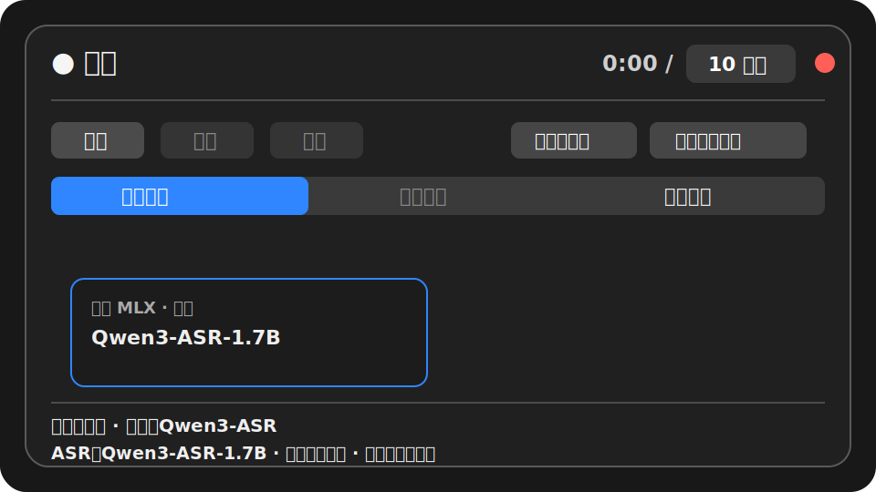
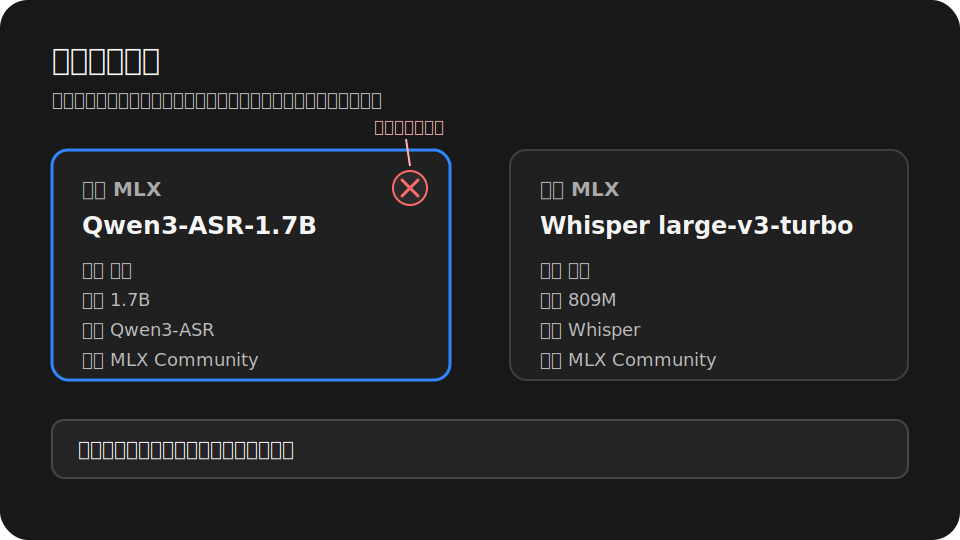
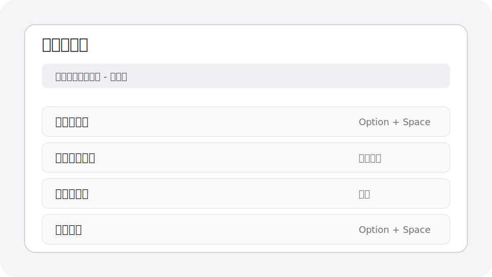
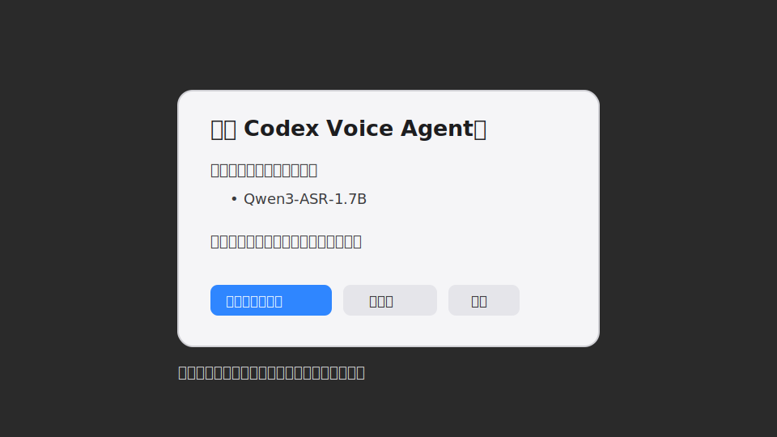

# Codex Voice Input

本機優先的 macOS 語音輸入工具。按一次內建全域快捷鍵開始錄音，再按一次提交；Codex Voice 會依照狀態列設定中選取的語言進行轉錄、校正與輸出：英文、簡體中文、繁體中文或日文。技術詞、命令、路徑、變數名和檔名會盡量保留標準英文或程式碼寫法。最終文字會寫入剪貼簿，且只有目前焦點確認是輸入框時才自動貼上。

語言版本：[English](README.md) | [简体中文](README.zh-CN.md) | 繁體中文 | [日本語](README.ja.md)

## 適合誰

- 經常在 Codex Desktop、Cursor、VS Code、瀏覽器、聊天工具或任何文字輸入框中，用英文、簡體中文、繁體中文或日文夾雜技術詞輸入。
- 希望轉錄與術語校正主要在本機完成，不預設把音訊送到外部服務。
- 希望全域快捷鍵由常駐狀態列 Agent 直接處理，反應足夠輕。

## 核心能力

- 內建全域快捷鍵：預設 `Option + Space`，也可以在狀態列面板中重新錄製。
- macOS 狀態列面板：開始、提交、取消、權限、模型、輸入裝置與日誌入口集中在同一個彈窗。
- 四語全流程：介面語言設定也控制 Whisper 辨識語言、Ollama 校正提示詞、CLI 使用者輸出和最終文字字形。
- 本機轉錄：預設使用適合 Apple Silicon 的 `mlx-whisper` large-v3-turbo，並保留 `faster-whisper` fallback。
- 本機校正：預設使用 Ollama 的 `qwen3.6:35b-a3b`，保守修正辨識錯誤、技術術語和格式。
- 統一貼上策略：一定先寫入剪貼簿；只有目前焦點確認可編輯時才模擬 `Cmd+V`。
- 模型管理：自動啟動 Ollama、自動載入目前 qwen 模型、保留 `keep_alive`，也能從 UI 卸載已載入模型。

## 工作方式

```text
內建全域快捷鍵
        |
        v
com.codexvoice.agent LaunchAgent
        |
        +-- 錄音、提交、取消、狀態列 UI
        +-- 解析介面/執行時語言
        +-- 依實際語言進行 Whisper 轉錄
        +-- terms.json 確定性術語替換
        +-- 依實際語言進行 Ollama 本機 LLM 校正
        +-- pbcopy 寫入剪貼簿
        +-- 目前焦點是輸入框時模擬 Cmd+V
```

## 系統需求

- macOS 13 或更新版本。
- 建議使用 Apple Silicon Mac；Intel Mac 可用，但本機轉錄速度可能慢很多。
- Conda、Miniconda、Miniforge 或 Anaconda。
- 建議用 Homebrew 安裝 `ffmpeg` 和 `portaudio`。
- Ollama 可選但強烈建議安裝，用於本機 LLM 校正。

## 安裝

建議直接把倉庫放在預設執行目錄：

```bash
git clone https://github.com/dataindustry/codex-voice.git ~/CodexVoice
cd ~/CodexVoice
bash ~/CodexVoice/bin/install.sh
```

如果已經在其他目錄 clone，先同步到預設執行目錄：

```bash
mkdir -p ~/CodexVoice
rsync -a --exclude .git /path/to/codex-voice/ ~/CodexVoice/
bash ~/CodexVoice/bin/install.sh
```

安裝腳本會：

- 建立 `bin/`、`config/`、`recordings/`、`transcripts/`、`logs/`、`state/`。
- 檢查 Homebrew、`ffmpeg`、`portaudio` 和 Ollama。
- 建立或更新 Conda 環境 `codex-voice`。
- 從 `pyproject.toml` 以 editable package 方式安裝 Codex Voice，並安裝測試/靜態檢查工具。
- 設定主程式和安裝腳本的可執行權限。
- 編譯並啟動 `com.codexvoice.agent` LaunchAgent。
- 編譯原生 Swift 錄音浮窗和狀態列 Agent。

只想重裝 Agent、不重裝 Python 依賴：

```bash
bash ~/CodexVoice/bin/install.sh --skip-deps
```

檢查 Agent 是否正在執行：

```bash
launchctl print gui/$(id -u)/com.codexvoice.agent
```

## AI Agent 安裝 Playbook

當你想讓 AI coding agent 在同一台 Mac 上安裝或更新 Codex Voice 時，可以把這一節交給它執行。

目標：把原始碼安裝或更新到 `~/CodexVoice`，盡量保留使用者設定，編譯狀態列 Agent，並驗證內建快捷鍵/Ollama 整合。

執行規則：

- 不要刪除 `~/CodexVoice/config/terms.json`、`transcripts/`、錄音、日誌、狀態檔或使用者改過的設定，除非使用者明確要求。
- 不要執行 `git reset --hard` 這類破壞性 git 指令。
- 如果倉庫 clone 在別處，先同步原始碼到 `~/CodexVoice`，再執行安裝器。
- 如果 Ollama 不存在，只回報並給出 `ollama pull qwen3.6:35b-a3b`；不要擅自下載大型模型。

推薦指令：

```bash
mkdir -p ~/CodexVoice
rsync -a --exclude .git /path/to/codex-voice/ ~/CodexVoice/
bash ~/CodexVoice/bin/install.sh
```

驗證指令：

```bash
launchctl print gui/$(id -u)/com.codexvoice.agent
codex-voice --status
codex-voice-config --show
codex-voice-config --list-ollama-models
```

安裝後，人類使用者仍需要在 macOS 系統設定中授權麥克風和輔助使用。預設內建快捷鍵是 `Option + Space`。

## macOS 權限

第一次使用需要兩個權限。

麥克風權限：

```text
System Settings -> Privacy & Security -> Microphone
```

授權 `Codex Voice Agent.app` 或觸發錄音的終端/宿主。如果沒有出現系統提示，可以在狀態列面板點「麥克風授權」，再重新觸發錄音。

輔助使用權限：

```text
System Settings -> Privacy & Security -> Accessibility
```

授權這個應用：

```text
~/CodexVoice/Codex Voice Agent.app
```

輔助使用權限只用於確認目前焦點是否為可編輯控制項，以及在確認可編輯時模擬 `Cmd+V`。如果焦點不在輸入框上，Codex Voice 不會強行貼上，只會把文字留在剪貼簿。

源碼安裝使用 ad-hoc 簽名。Agent 重新編譯或重新簽名後，安裝腳本會用 `tccutil` 重置輔助使用項目並打開系統設定；macOS 仍需要使用者手動重新勾選授權。

## 隱私預設值

Codex Voice 是本機優先工具。預設情況下，錄音只作為暫存檔存在，轉錄後刪除：

```json
"save_recordings": false,
"save_transcripts": true
```

逐字稿會保存到 `~/CodexVoice/transcripts`，方便回看識別品質。如果不希望 raw text、final text 和校正中繼資料落盤，把 `save_transcripts` 改成 `false`。

## 內建快捷鍵

狀態列 Agent 啟動時會註冊原生全域快捷鍵，預設是 `Option + Space`。

可以在狀態列面板裡：

- 錄製新的快捷鍵；
- 清除目前快捷鍵；
- 恢復預設 `Option + Space`。

按下快捷鍵時，Agent 會直接呼叫 `codex-voice.py --toggle`。舊的外部觸發檔整合已從主原始碼樹移除，快捷鍵由常駐 Agent 統一處理。

## 語言與輸出策略

Codex Voice 不自動偵測說話人的語言。設定浮層裡選取的語言就是整條處理鏈路的產品策略：

| 設定 | Whisper 語言 | 校正/輸出行為 |
| --- | --- | --- |
| `跟隨系統` | 依 macOS 首選語言解析；不支援的系統語言預設為英文。 | 使用下方對應的實際語言。 |
| `English` | `en` | 依英文校正並輸出英文。 |
| `简体中文` | `zh` | 依簡體中文校正並輸出簡體中文；英文技術詞保留英文。 |
| `繁體中文` | `zh` | 依繁體中文校正並輸出繁體中文；英文技術詞保留英文。 |
| `日本語` | `ja` | 依日文校正並輸出日文；英文技術詞保留英文。 |

可以在狀態列面板的設定浮層切換，也可以使用 CLI：

```bash
codex-voice-config --set-ui-language system
codex-voice-config --set-ui-language en
codex-voice-config --set-ui-language zh-Hans
codex-voice-config --set-ui-language zh-Hant
codex-voice-config --set-ui-language ja
```

## Ollama 設定

安裝 Ollama 後，先拉取推薦校正模型：

```bash
ollama pull qwen3.6:35b-a3b
```

如果 Ollama 不在預設 `127.0.0.1:11434`，建議用 launchd 環境變數告訴 Agent：

```bash
launchctl setenv OLLAMA_HOST 127.0.0.1:11435
bash ~/CodexVoice/bin/install-launch-agents.sh
```

Codex Voice 的 Ollama 位址解析順序：

1. `OLLAMA_HOST`
2. `launchctl getenv OLLAMA_HOST`
3. 使用者明確設定的非預設 `ollama_base_url` 或 `ollama_url`
4. 預設 `http://127.0.0.1:11434`

查看模型掃描結果：

```bash
conda run -n codex-voice python ~/CodexVoice/bin/codex-voice-config.py --list-ollama-models
```

預熱目前校正模型：

```bash
conda run -n codex-voice python ~/CodexVoice/bin/codex-voice-config.py --prepare-current-correction-model
```

預設校正設定重點：

```json
"ollama_model": "qwen3.6:35b-a3b",
"ollama_num_ctx": 4000,
"ollama_num_predict": 256,
"ollama_keep_alive": -1,
"ollama_timeout_seconds": 7,
"ollama_skip_simple_utterances": true
```

說明：

- `keep_alive: -1` 是 Ollama 請求參數，表示盡量把 qwen 模型保留在記憶體中；它和 macOS LaunchAgent 的 `KeepAlive` 無關。
- `num_ctx: 4000` 面向一般十分鐘內語音轉寫後的校正場景。非常長的逐字稿仍建議分段處理。
- 如果 Ollama 已安裝但服務未啟動，Agent 會嘗試自動啟動或喚醒 Ollama。
- 如果預設 qwen 模型沒有安裝，介面會用目前語言顯示 `qwen3.6:35b-a3b` 未安裝；程式不會自動下載大型模型。

## 模型選擇建議

轉錄模型：

| 模型 | 推薦程度 | 說明 |
| --- | --- | --- |
| `mlx-community/whisper-large-v3-turbo` | 預設推薦 | Apple Silicon 上速度和準確率較均衡。 |
| `faster-whisper large-v3-turbo` | 相容備用 | MLX 不可用時使用，通常較慢但覆蓋面較廣。 |
| Ollama audio/Whisper 類模型 | 實驗性 | 只有本機 Ollama 偵測到具備 audio 能力或名稱像 ASR/Whisper 的模型時才顯示。 |

校正模型：

| 模型 | 推薦程度 | 說明 |
| --- | --- | --- |
| `qwen3.6:35b-a3b` | 預設推薦 | 多語口述校正、IT 術語保留和保守改寫的本機預設選擇。需要較多記憶體，適合常駐載入。 |
| 中等尺寸 Qwen / coder 模型 | 可選 | 記憶體壓力較小時可嘗試，反應更快，但中文口述校正穩定性通常弱於預設 35B。 |
| `qwen2.5-coder:1.5b` | 僅建議測速 | 很快，但容易把自然口述改得太像程式碼或英文，不建議長期預設使用。 |
| `規則校正（不使用 LLM）` | 快速兜底 | 不依賴 Ollama，適合 Ollama 未安裝、模型未下載或只需要確定性術語替換時使用。 |

## 介面與截圖說明

以下圖片是繁體中文介面截圖說明。其他語言 README 會引用各自語言的截圖路徑，之後可依語言用同名真實截圖取代這些 SVG，README 連結不需要改。

### 狀態列主面板



主面板是日常使用 Codex Voice 的主要入口：

- 頂部狀態列：圓點與文字顯示閒置、錄音、轉寫或錯誤狀態；計時器顯示目前錄音時間；最長錄音時間可直接調整；紅色按鈕用來退出 Agent。
- 波形區域：錄音或測試輸入裝置時，用來確認麥克風有輸入。
- 錄音操作：`開始`、`提交`、`取消` 分別對應開始錄音、送出目前錄音與放棄目前錄音。
- 權限與設定：語言選擇、麥克風權限、輔助使用權限、內建快捷鍵錄製、清除、恢復預設，以及錄音浮窗開關都在這裡管理。
- 標籤頁：`轉錄模型`、`校正模型`、`輸入裝置` 切換下方卡片區；卡片區高度會跟隨目前頁面內容收緊，不保留其他標籤頁的舊高度。
- 底部摘要：集中顯示目前狀態、轉錄模型、校正模型和輸入裝置，方便確認最後生效的設定。

### 模型卡片



模型卡片用來選擇轉錄模型、校正模型和輸入裝置：

- 每張卡片顯示來源、模型名、參數規模、架構和廠商；沒有對應資訊時會保持簡潔，不用空白硬撐高度。
- 同一組卡片保持等高，但高度由內容自動測量，長模型名會在固定寬度內換行。
- 目前選取的卡片會高亮；不可用卡片會說明原因，例如正在掃描、正在啟動 Ollama、未安裝 qwen，或沒有偵測到輸入裝置。
- 卡片列表可以橫向拖動或捲動，多個 Ollama 模型和多個輸入裝置不會擠壓版面。
- 已載入的 Ollama 模型右上角會出現圓形 `X`。點擊後只把模型從記憶體卸載，不刪除磁碟上的模型檔案。
- 如果 qwen 已安裝但尚未載入，Codex Voice 會在卡片區顯示載入狀態，並使用設定裡的 Ollama `keep_alive` 和上下文長度預熱模型。

### 內建快捷鍵



設定浮層用來錄製和管理原生全域快捷鍵：

- 預設快捷鍵是 `Option + Space`。
- 一般組合鍵必須包含至少一個修飾鍵；儲存前會使用 macOS 公開的熱鍵註冊 API 做一次可用性檢查。
- 雙擊修飾鍵手勢，例如雙擊 Control，也可以錄製；但 macOS 沒有公開 API 可以可靠檢查這類手勢是否被其他應用程式占用，因此不會標記為「已檢測無衝突」。
- `清除` 會停用目前內建快捷鍵；`預設` 會恢復 `Option + Space`。
- 設定浮層開啟時會擋住下方卡片區，底層卡片不會繼續回應 hover、點擊或滾輪。

### 退出並卸載模型



退出流程會明確處理仍在執行的錄音和仍在記憶體中的 Ollama 模型：

- 如果目前還有錄音 worker，Codex Voice 會先詢問是否取消錄音並退出。
- 如果 Ollama 目前仍有已載入模型，彈窗會列出模型名稱，並提供 `退出並卸載模型`、`僅退出`、`取消`。
- `退出並卸載模型` 會向 Ollama 送出 `keep_alive: 0`，只釋放記憶體中的模型，不刪除已安裝模型。
- 卸載失敗會提示，但不會讓 Agent 無限卡在退出流程裡。

## 常用操作

```text
按一次內建快捷鍵 -> 開始錄音
再按一次同一個快捷鍵 -> 提交錄音
```

設定最長錄音時間：

```bash
conda run -n codex-voice python ~/CodexVoice/bin/codex-voice-config.py --set-max-minutes 10
```

打開設定、術語表、轉寫記錄和日誌：

```bash
open -e ~/CodexVoice/config/config.json
open -e ~/CodexVoice/config/terms.json
open ~/CodexVoice/transcripts
tail -n 120 ~/CodexVoice/logs/codex-voice.log
```

## 設定檔

主要設定：

```text
~/CodexVoice/config/config.json
```

重要語言欄位：

```json
"ui_language": "system"
```

`ui_language` 可以是 `system`、`en`、`zh-Hans`、`zh-Hant` 或 `ja`。它控制介面文字、CLI 使用者輸出、Whisper 辨識語言、Ollama 校正提示詞和最終輸出字形。`output_language`、`force_simplified_chinese` 等舊欄位仍可相容讀取，但新的設定不建議依賴它們。

術語和確定性替換：

```text
~/CodexVoice/config/terms.json
```

校正提示詞：

```text
~/CodexVoice/config/correction_prompt.txt
```

確定性替換會先於 Ollama 校正執行。適合放進 `terms.json` 的內容包括專案名、函式庫名、命令、檔名、專有縮寫和穩定錯詞。

## 故障排查

內建快捷鍵無法使用：

```bash
tail -n 120 ~/CodexVoice/logs/codex-voice.log
open -e ~/CodexVoice/config/config.json
```

打開狀態列面板。如果顯示快捷鍵不可用或可能衝突，請錄製新的組合鍵，或恢復預設值。

Agent 沒有執行：

```bash
bash ~/CodexVoice/bin/install-launch-agents.sh
launchctl print gui/$(id -u)/com.codexvoice.agent
```

Ollama 模型未顯示：

```bash
which ollama
ollama list
conda run -n codex-voice python ~/CodexVoice/bin/codex-voice-config.py --list-ollama-models
```

無法自動貼上時，請確認已授權輔助使用、目前焦點是文字輸入框；如果剛重新編譯 Agent，請在安裝腳本重置並打開系統設定後重新勾選授權。即使不自動貼上，最終文字也已在剪貼簿中。

## 停止或移除

```bash
launchctl bootout gui/$(id -u) ~/Library/LaunchAgents/com.codexvoice.agent.plist
rm -f ~/Library/LaunchAgents/com.codexvoice.agent.plist
rm -rf ~/CodexVoice
```

如果只想退出本次執行，點狀態列面板右上角紅色退出按鈕即可。LaunchAgent 的 macOS `KeepAlive` 為 `false`，使用者退出後不會立刻被系統自動拉起。
